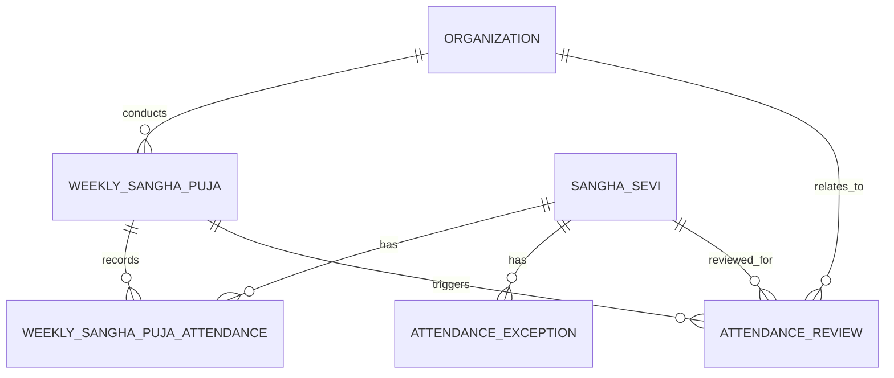

# NSS ERP Attendance Module ERD

---

# Document Metadata

| Item | Value |
|---|---|
| Document Name | Attendance Module ERD |
| Document ID | SOL-ATT-002 |
| Domain | Attendance |
| Repository Path | docs/03_Solution/modules/attendance/02_attendance_erd.md |
| Version | 1.0.0 |
| Status | DRAFT |
| Parent Document | 01_attendance_module_overview.md |

---

# 1. Purpose

This document defines the logical Entity Relationship Diagram for the NSS ERP Attendance Module.

---

# 2. Core Attendance Entities

The Attendance design includes:

```text
weekly_sangha_puja

weekly_sangha_puja_attendance

attendance_exception

attendance_review
```

These entities represent the core Weekly Sangha Puja attendance and Attendance Review workflow.

---

# 3. Logical ERD



---

# 4. Weekly Sangha Puja

The Weekly Sangha Puja entity represents an individual attendance event.

Relationship:

```text
Sakha
    |
Weekly Sangha Puja
```

---

# 5. weekly_sangha_puja

The entity identifies:

* Sakha
* Puja Date
* Remarks
* Audit information

Example:

```text
Ekamra Sakha
    |
Weekly Sangha Puja
    |
07-Jun-2026
```

---

# 6. weekly_sangha_puja_attendance

This entity records attendance for a specific Weekly Sangha Puja.

Relationship:

```text
Weekly Sangha Puja
        |
Attendance
        |
Sangha Sevi
```

---

# 7. Attendance Status

Each attendance record contains one controlled attendance status:

```text
PRESENT

ABSENT

EXCUSED_ABSENCE
```

---

# 8. Membership Relationship

Attendance references the authoritative Membership identity:

```text
sangha_sevi
```

The Attendance Module shall not create another Member identity.

---

# 9. Home Sakha and Attendance Sakha

For cross-Sakha attendance, the ERD must support the distinction between:

```text
Member's Home Sakha
```

and:

```text
Sakha Where Attendance Was Recorded
```

Therefore:

```text
Membership
    |
Home Organization

Attendance Event
    |
Attendance Organization
```

The attendance event's Sakha shall represent where the Member actually attended.

---

# 10. Attendance Exception

An Attendance Exception represents an approved reason for absence or another controlled attendance exception.

Relationship:

```text
Sangha Sevi
    |
Attendance Exception
```

An exception may cover a defined date range.

---

# 11. Attendance Review

Attendance Review is created when the applicable attendance monitoring condition is reached.

Relationship:

```text
Weekly Sangha Puja Attendance
        |
Consecutive Absence Detection
        |
Attendance Review
```

---

# 12. Attendance Review Status

The review entity supports:

```text
OPEN

DEFERRED

CLOSED

ESCALATED_TO_PRESIDENT

ESCALATED_TO_PARICHALAK
```

---

# 13. Review Authority

The ERD supports operational responsibility for:

```text
Secretary
President
Parichalak
```

The Secretary is the primary operational reviewer.

The President provides oversight and appeal authority.

Parichalak involvement is an escalation path where required.

---

# 14. Review History

Attendance Review actions shall remain traceable.

The system shall preserve:

* Review creation
* Explanation
* Excused Absence approval
* Deferral
* Closure
* Escalation
* Override
* Reopening

---

# 15. Family Relationship

Family is not the owner of Attendance.

Family information may be accessed during an Attendance Review where authorized.

Example:

```text
Attendance Review
        |
Member
        |
Family
```

The Attendance Module shall not duplicate Family relationships.

---

# 16. Governance Relationship

Attendance Review may involve governance authorities.

However:

```text
Attendance is not equal to Governance Position
```

Governance authority is provided by the Governance Module.

---

# 17. Deletion Principle

Attendance and Attendance Review history shall not be physically deleted.

Historical records remain available for:

* Audit
* Reporting
* Membership review
* Governance review

---

# 18. ERD Principles

```text
Attendance Is Event Based

Membership Identity Is Authoritative

Home Sakha is not equal to Attendance Sakha Where Cross-Sakha Attendance Occurs

Attendance Status Is Master Data Driven

Attendance Review Is Human Controlled

History Never Deleted

Membership Action Is Separate From Attendance Recording
```

---

# End of Document
