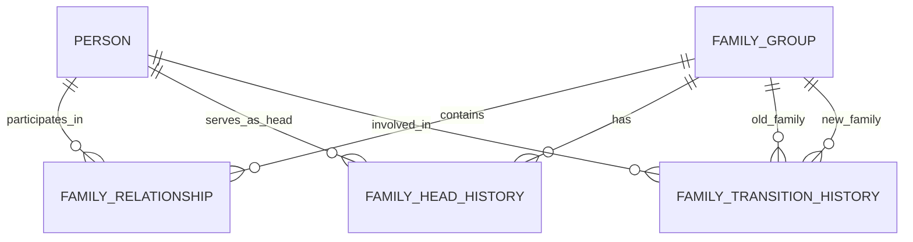

# NSS ERP Family Module ERD

---

# Document Metadata

| Item | Value |
|---|---|
| Document Name | Family Module ERD |
| Document ID | SOL-FAM-002 |
| Domain | Family |
| Repository Path | docs/03_Solution/modules/family/02_family_erd.md |
| Version | 1.0.0 |
| Status | DRAFT |
| Parent Document | 01_family_module_overview.md |

---

# 1. Purpose

This document defines the logical Entity Relationship Diagram for the NSS ERP Family Module.

The Family Module is based on the Family First model.

---

# 2. Core Family Relationship

The fundamental relationship is:

```text
Person
    |
Family Relationship
    |
Family Group
```

A Person may exist without Family membership.

A Person may belong to a Family without being an NSS Member.

---

# 3. Core Entities

The frozen Family Module contains:

```text
family_group

family_head_history

family_relationship

family_transition_history
```

The four-table Family baseline was established in the NSS V2 database design.

---

# 4. Logical ERD



---

# 5. family_group

Represents the Family identity.

Relationship:

```text
Family Group
    |
    +-- Family Relationships
    +-- Family Head History
    +-- Family Transition History
```

---

# 6. family_relationship

Connects a Person to a Family Group.

Example:

```text
Family Group
    |
    +-- Father
    +-- Mother
    +-- Husband
    +-- Wife
    +-- Son
    +-- Daughter
```

The relationship type identifies the Person's relationship to the Family.

---

# 7. family_head_history

Stores historical Family Head assignments.

Relationship:

```text
Family Group
    |
Family Head History
    |
Person
```

The current Family Head may be determined from the active/current historical assignment.

Previous Family Heads remain historically traceable.

---

# 8. family_transition_history

Stores historical Family Group transitions.

Example:

```text
Old Family
    |
Marriage / Transition
    |
New Family
```

The project specifically added family_transition_history to preserve family lineage during marriage and related transitions.

---

# 9. Membership Relationship

Membership is outside the Family core schema.

Relationship:

```text
Person
    |
Family Relationship
    |
Family
    +
Person
    |
Membership
```

The Family Module must not create a duplicate Membership identity.

---

# 10. Kumari Relationship

Kumari participation remains in the Kumari Module.

The Family Module provides family context through:

```text
Person
    |
Family Relationship
    |
Family
```

A Kumari participant may exist without NSS Membership.

---

# 11. Kishor Relationship

Kishor participation remains in the Kishor Module.

Family provides context.

Guardian assignment remains in the Kishor Module.

---

# 12. Family Transition Example

Example:

```text
Panda Family
    |
    +-- Daughter
          |
       Marriage
          |
     New Family
```

The original family relationship shall remain historically traceable.

---

# 13. Family Tree

The ERD supports a Family Tree through:

```text
family_group
        |
family_relationship
        |
person
```

A Family Dashboard can therefore display:

```text
Grandparents
      |
Parents
      |
Children
```

where sufficient relationship data exists.

---

# 14. Family Visibility

Family visibility may aggregate information from:

```text
family_group

family_relationship

person

sangha_sevi

kumari_membership

kishor_participant
```

The aggregated view does not replace ownership of data in the respective modules.

---

# 15. Data Ownership

| Data                  | Authoritative Module |
| --------------------- | -------------------- |
| Person Identity       | Person               |
| Membership            | Membership           |
| Family Identity       | Family               |
| Family Relationship   | Family               |
| Family Head History   | Family               |
| Family Transition     | Family               |
| Kumari Participation  | Kumari               |
| Kishor Participation | Kishor              |
| Guardian Assignment   | Kishor              |
| Mahila Participation  | Mahila               |

---

# 16. Deletion Principle

Family history shall not be physically deleted.

Historical relationships and transitions shall remain available for audit and family lineage.

---

# 17. ERD Principles

```text
Family First

Person is not equal to Member

Family is not equal to Membership

One Person may belong to a Family without Membership

Family History Never Deleted

Family Transition History Preserved

Module Data Ownership Preserved
```

---

# End of Document
