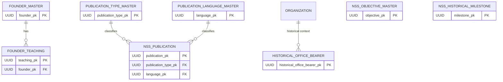
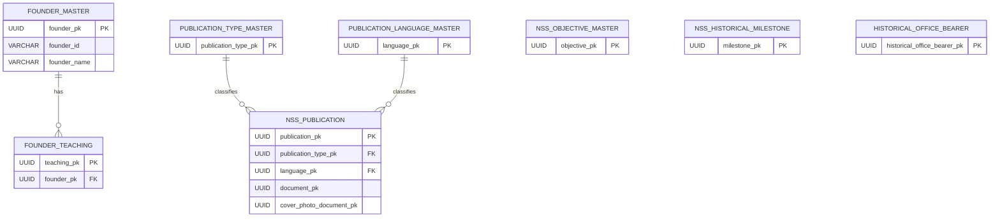

# NSS ERP — Founder & Heritage ERD

**Document ID:** SOL-HER-002  
**Version:** 1.0.0  
**Status:** DRAFT — SOURCE ALIGNED  
**Module:** Founder & Heritage  
**Parent System:** Nilachala Saraswata Sangha ERP

---

# 1. Purpose

This document defines the logical Entity Relationship Diagram for the Founder & Heritage Module.

The ERD represents the current frozen Founder & Heritage foundation:

- Founder
- Founder Teachings
- NSS Objectives
- Historical Milestones
- Publications
- Historical Office Bearers
- Publication Type Master
- Publication Language Master

This document defines logical relationships only.

It does not define PostgreSQL DDL or physical SQL implementation.

---

# 2. Current Frozen Entities

The current Founder & Heritage foundation contains six core tables:

```text
founder_master
founder_teaching
nss_objective_master
nss_historical_milestone
nss_publication
historical_office_bearer
```

The publication framework additionally uses:

```text
publication_type_master
publication_language_master
```

The current frozen scope is therefore:

```text
Core Heritage Tables       = 6
Supporting Masters         = 2
Total Current Scope        = 8
```

This matches the frozen source.

---

# 3. High-Level ERD



---

# 4. Important ERD Boundary

Not every Heritage entity requires a foreign-key relationship to another Heritage table.

The following are independent reference/history domains:

```text
nss_objective_master
nss_historical_milestone
historical_office_bearer
```

They are related conceptually to NSS Heritage but are not artificially linked together merely to produce a connected diagram.

---

# 5. Founder Domain

```text
FOUNDER_MASTER
       |
       |
       +------< FOUNDER_TEACHING
```

The Founder is the parent/reference entity for Founder teachings.

---

# 6. `founder_master`

## Purpose

Represents the Founder reference record.

The frozen design treats this as a special reference table containing exactly one Founder.

Founder:

```text
Swami Nigamananda Paramahansa Dev
```

The source explicitly states that the Founder record is immutable and is never deleted.

---

# 7. Founder Cardinality

Logical relationship:

```text
FOUNDER_MASTER
      1
      |
      N
FOUNDER_TEACHING
```

There is one Founder reference record and potentially many teachings.

---

# 8. Founder Identity

The Founder identity is not modeled through the ordinary Person/Membership lifecycle.

The Heritage module represents the Founder as an institutional historical/reference entity.

Therefore:

```text
Founder Heritage Record
        ≠
Current NSS Member Record
```

---

# 9. `founder_teaching`

## Purpose

Stores Founder teachings, philosophy, quotes, and principles.

The frozen foundation explicitly identifies `founder_teaching` for this purpose.

---

# 10. Founder Teaching Relationship

```text
FOUNDER_MASTER
      |
      | 1:N
      ▼
FOUNDER_TEACHING
```

Each teaching belongs to the Founder reference.

---

# 11. Founder Teaching Foreign Key

Logical relationship:

```text
founder_teaching.founder_pk
            ↓
founder_master.founder_pk
```

This establishes the Founder as the authoritative parent reference.

---

# 12. Founder Teaching Content

A teaching may represent:

```text
Teaching
Philosophy
Quote
Principle
```

The exact content structure belongs to the table design document.

---

# 13. NSS Objectives Domain

```text
NSS_OBJECTIVE_MASTER
```

represents official NSS objectives.

The frozen foundation identifies this as an independent core Heritage table.

---

# 14. Objective Relationship Boundary

Objectives are not modeled as children of:

```text
founder_master
```

even though the Founder and NSS philosophy are historically related.

The objective record represents an official NSS institutional objective.

Therefore the ERD does not invent:

```text
founder_pk → nss_objective_master
```

unless an authoritative requirement explicitly establishes such a relationship.

---

# 15. Objective Cardinality

The current logical model is:

```text
NSS
 |
 +----< NSS_OBJECTIVE_MASTER
```

The NSS organizational context is conceptual rather than requiring a direct FK to a generic NSS organization record in this Heritage table.

---

# 16. `nss_objective_master`

## Purpose

Stores official NSS objectives.

The objective source is authoritative organizational content.

Objectives should be treated as reference/institutional content rather than transactional records.

---

# 17. Historical Milestone Domain

```text
NSS_HISTORICAL_MILESTONE
```

stores important NSS historical events and milestones.

The table is independently owned by the Heritage module.

---

# 18. Milestone Relationship Boundary

A milestone is not automatically a Founder Teaching.

Therefore:

```text
Historical Milestone
        ≠
Founder Teaching
```

No artificial relationship is introduced.

---

# 19. Milestone Model

Conceptually:

```text
NSS HISTORY
    |
    +----< HISTORICAL MILESTONE
```

A milestone may contain its own:

* Date
* Title
* Description
* Historical significance
* Supporting reference

The exact fields belong to the table design.

---

# 20. Publications Domain

The publication structure is:

```text
PUBLICATION_TYPE_MASTER
          |
          | 1:N
          ▼
   NSS_PUBLICATION
          ▲
          | N:1
          |
PUBLICATION_LANGUAGE_MASTER
```

This is the primary relational structure of the Publication Library.

---

# 21. `nss_publication`

## Purpose

Represents an NSS publication.

The frozen framework supports publications including:

```text
Books
Magazines
Journals
Newsletters
Annual Reports
UPBS Souvenirs
Research Publications
Pamphlets
Booklets
Other
```

The publication framework is frozen at this scope.

---

# 22. Publication Type Relationship

```text
PUBLICATION_TYPE_MASTER
          |
          | 1:N
          ▼
NSS_PUBLICATION
```

Each publication has one applicable publication type.

One publication type may classify many publications.

---

# 23. Publication Type Foreign Key

Logical relationship:

```text
nss_publication.publication_type_pk
             ↓
publication_type_master.publication_type_pk
```

---

# 24. Publication Language Relationship

```text
PUBLICATION_LANGUAGE_MASTER
          |
          | 1:N
          ▼
NSS_PUBLICATION
```

Each publication has one recorded language classification.

One language may be used by many publications.

---

# 25. Publication Language Foreign Key

Logical relationship:

```text
nss_publication.language_pk
             ↓
publication_language_master.language_pk
```

Language is mandatory in the frozen publication framework.

---

# 26. Publication Type Master

The frozen publication type classifications include:

```text
BOOK
MAGAZINE
JOURNAL
NEWSLETTER
ANNUAL_REPORT
UPBS_SOUVENIR
RESEARCH_PUBLICATION
PAMPHLET
BOOKLET
OTHER
```

These are master-data classifications rather than free-text values.

---

# 27. Publication Language Master

The frozen publication language classifications include:

```text
ODIA
ENGLISH
HINDI
BENGALI
ASSAMESE
TELUGU
TAMIL
OTHER
```

---

# 28. Publication Edition Relationship

Multiple editions of a publication are supported.

The current logical model retains edition information within the publication record.

The ERD therefore does not introduce a separate:

```text
publication_edition
```

table in the current frozen scope.

---

# 29. Digital Publication Relationship

The frozen publication model supports a digital document reference.

Conceptually:

```text
NSS_PUBLICATION
       |
       └── document_pk
               ↓
       Common Document Management
```

The actual Document Management table belongs to the common Person/Foundation/Document domain, not to Founder & Heritage.

---

# 30. Cover Image Relationship

The publication framework also supports:

```text
cover_photo_document_pk
```

This is a reference to the common document/file infrastructure.

It does not create a separate Heritage image table.

---

# 31. Publication Availability

A publication may have:

```text
Physical Copy
+
Digital Copy
```

These are independent availability concepts.

The existence of a digital document does not eliminate the physical publication record.

---

# 32. Publication Pricing

The publication model supports:

```text
Free
Donation Based
Fixed Price
```

Pricing is an attribute of the publication domain rather than a separate transaction entity in the current frozen foundation.

---

# 33. Historical Office Bearer Domain

```text
HISTORICAL_OFFICE_BEARER
```

preserves historical leadership information.

Examples include:

```text
Presidents
Parichalaks
Secretaries
Other Historical Office Bearers
```

The table is part of the six-table frozen Heritage foundation.

---

# 34. Historical Office Bearer vs Current Governance

The relationship is deliberately separated:

```text
HISTORICAL_OFFICE_BEARER
        |
        | historical reference
        X
CURRENT GOVERNANCE
```

Historical office-bearer data does not replace current:

```text
governing_body
governing_body_member
position_assignment
```

Current Governance remains owned by the Governance module.

---

# 35. Historical Office Bearer and Person

Where a historical office bearer can be reliably associated with a common Person record, the common Person identity may be referenced according to the finalized table design.

The current source does not provide sufficient detail here to invent the exact foreign-key structure.

Therefore this ERD does not force a specific Person FK beyond what the authoritative table design establishes.

---

# 36. Historical Office Bearer and Organization

Historical office-bearer information may require organizational context.

Where such context is defined by the final source/table design, it shall reference the common Organization framework.

The exact relationship is intentionally not invented here.

---

# 37. Current vs Historical Leadership

The distinction is mandatory:

```text
Historical Office Bearer
        ≠
Current Office Bearer
```

Historical records remain preserved even when the same person later holds another position.

---

# 38. Founder & Heritage Complete ERD



---

# 39. Conceptual Heritage Map

```text
                         FOUNDER & HERITAGE
                                  |
          ┌───────────────────────┼───────────────────────┐
          │                       │                       │
          ▼                       ▼                       ▼
       FOUNDER              NSS HERITAGE            PUBLICATIONS
          │                       │                       │
          │                       ├── Objectives          │
          │                       │                       ├── Type
          │                       └── Milestones          └── Language
          │                                               │
          └── Teachings                                   ▼
                                                     Publications
                                                          
                                  |
                                  ▼
                       HISTORICAL OFFICE BEARERS
```

---

# 40. Entity Ownership Summary

| Entity                        | Domain       | Relationship                             |
| ----------------------------- | ------------ | ---------------------------------------- |
| `founder_master`              | Founder      | Parent of teachings                      |
| `founder_teaching`            | Founder      | Child of Founder                         |
| `nss_objective_master`        | NSS Heritage | Independent reference                    |
| `nss_historical_milestone`    | NSS Heritage | Independent historical record            |
| `nss_publication`             | Publications | Classified by type/language              |
| `publication_type_master`     | Publications | Publication classification               |
| `publication_language_master` | Publications | Publication language                     |
| `historical_office_bearer`    | History      | Independent historical leadership record |

---

# 41. Relationship Summary

```text
founder_master
      1
      |
      N
founder_teaching
```

```text
publication_type_master
      1
      |
      N
nss_publication
```

```text
publication_language_master
      1
      |
      N
nss_publication
```

The following remain independent Heritage domains:

```text
nss_objective_master

nss_historical_milestone

historical_office_bearer
```

---

# 42. Why Objectives Are Independent

The ERD intentionally does not define:

```text
founder_master
      |
      └── nss_objective_master
```

because the current source identifies objectives as official NSS objectives, not merely as Founder Teaching child records.

This preserves the distinction between:

```text
Founder Teachings
        and
Official NSS Objectives
```

---

# 43. Why Milestones Are Independent

Historical milestones are institutional history.

They are not automatically:

```text
Founder Teachings
```

or:

```text
Publications
```

Therefore they remain an independent historical domain.

---

# 44. Why Historical Office Bearers Are Independent

Historical office bearers preserve leadership history.

They are not current Governance assignments.

This separation allows:

```text
Historical Record
        +
Current Governance
```

to coexist without rewriting history.

---

# 45. Publication Master-Data Model

Publication classifications are normalized:

```text
PUBLICATION_TYPE_MASTER
          |
          +---- Book
          +---- Magazine
          +---- Journal
          +---- Newsletter
          +---- Annual Report
          +---- ...
          
PUBLICATION_LANGUAGE_MASTER
          |
          +---- Odia
          +---- English
          +---- Hindi
          +---- ...
```

Publications reference these masters.

---

# 46. Publication Document Integration

```text
NSS_PUBLICATION
      |
      ├── document_pk
      │       ↓
      │  Common Document System
      │
      └── cover_photo_document_pk
              ↓
         Common Document System
```

No separate Heritage document-storage table is introduced in the current scope.

---

# 47. Founder Photo Integration

The Founder Master may reference a common document/photo record according to the frozen Founder design.

Conceptually:

```text
FOUNDER_MASTER
      |
      └── photo_document_pk
              ↓
       Common Document System
```

---

# 48. No Duplicate Document Domain

Founder & Heritage shall not create:

```text
heritage_document
heritage_file
heritage_photo
```

as current frozen entities.

Those have been identified as future enhancements rather than current scope.

---

# 49. No Founder Quote Table

The current ERD does not create:

```text
founder_quote
```

as a separate entity.

Quotes are currently within the broader Founder Teaching scope.

A separate quote entity remains a future enhancement.

---

# 50. No Publication Author Table

The current ERD does not create:

```text
publication_author
```

as a current frozen entity.

It is a future recommended enhancement.

---

# 51. No Historical Event Participant Table

The current ERD does not create:

```text
historical_event_participant
```

as a current frozen entity.

It remains a future enhancement.

---

# 52. No Heritage Photo Gallery Table

The current ERD does not create:

```text
heritage_photo_gallery
```

as a current frozen entity.

The common Document framework is used where the current design supports document/image references.

---

# 53. Common Module Dependencies

Founder & Heritage may reference common modules including:

```text
Person
Organization
Document Management
Master Data
Authentication
RBAC
Audit
```

These modules remain authoritative for their respective domains.

---

# 54. No Duplicate Person Identity

Founder & Heritage shall not create a duplicate general-purpose Person entity.

---

# 55. No Duplicate Organization Identity

Historical organizational references shall use the common Organization framework where applicable.

---

# 56. No Duplicate Document Storage

Digital publications and photographs shall use the common Document framework.

---

# 57. No Duplicate Master Framework

Publication type and language masters are retained because they are part of the frozen publication framework.

They should follow the project's common master-data standards.

---

# 58. Historical Integrity

The ERD supports preservation of historical records.

The following shall remain independently traceable:

```text
Founder
Founder Teachings
Objectives
Historical Milestones
Historical Office Bearers
Publications
```

Historical records must not be silently overwritten by current operational data.

---

# 59. Public Heritage Portal Relationship

The Heritage Portal consumes the logical model:

```text
Founder
   ↓
Biography / Philosophy / Teachings

NSS Heritage
   ↓
Objectives / Milestones

Publications
   ↓
Publication Library

History
   ↓
Historical Office Bearers
```

---

# 60. Administrative Relationship

Authorized administrators manage the same domain records through administrative interfaces.

The ERD does not create a separate public-content database.

---

# 61. Read vs Write Boundary

Public users may receive read access to approved Heritage content.

Administrative users may have controlled write/update access.

The access model is governed by common Authentication/RBAC.

---

# 62. Audit Relationship

Heritage entities participate in the common audit framework.

No separate:

```text
heritage_audit
```

entity is introduced.

---

# 63. Logical Integrity Rules

The ERD shall preserve:

```text
One immutable Founder reference
Many Founder Teachings
Many NSS Objectives
Many Historical Milestones
Many Publications
Many Historical Office Bearers
Many Publications per Type
Many Publications per Language
```

---

# 64. Publication Language Rule

Every `nss_publication` record must have a language classification.

Therefore:

```text
nss_publication
      N:1
publication_language_master
```

Language is mandatory in the frozen publication design.

---

# 65. Publication Type Rule

Every publication shall be classified using the approved publication type master.

---

# 66. Founder Record Rule

`founder_master` contains one immutable Founder reference record.

The current source explicitly removes the need for:

```text
is_active
display_order
```

and states that the Founder record is never deleted.

---

# 67. No Multiple Founders

The current NSS Heritage design does not model multiple Founder records.

The Founder is:

```text
Swami Nigamananda Paramahansa Dev
```

---

# 68. ERD Scope

This ERD includes only:

```text
CURRENT FROZEN SCOPE
```

It does not include proposed future Heritage enhancements.

---

# 69. Future Extension Boundary

Potential future entities include:

```text
founder_quote
heritage_document
heritage_photo_gallery
publication_author
historical_event_participant
heritage_category_master
```

These are deliberately outside this current ERD.

They may be introduced only after separate approval.

---

# 70. Complete Logical Dependency Map

```text
                       COMMON FOUNDATION
                              |
          ┌───────────────────┼───────────────────┐
          │                   │                   │
          ▼                   ▼                   ▼
       DOCUMENT           ORGANIZATION          PERSON
          │                   │                   │
          │                   │                   │
          └──────────────┬────┴───────────────────┘
                         │
                         ▼
                  FOUNDER & HERITAGE
                         │
        ┌────────────────┼─────────────────┐
        │                │                 │
        ▼                ▼                 ▼
     FOUNDER          HERITAGE        PUBLICATIONS
        │                │                 │
        │                ├── Objectives    ├── Type
        │                └── Milestones    └── Language
        │                                  │
        └── Teachings                     ▼
                                     NSS Publication
                         │
                         ▼
                  Historical Office
                       Bearers
```

---

# 71. Final ERD Statement

The current Founder & Heritage ERD is therefore:

```text
FOUNDER_MASTER
      |
      └── FOUNDER_TEACHING

NSS_OBJECTIVE_MASTER

NSS_HISTORICAL_MILESTONE

NSS_PUBLICATION
      |
      ├── PUBLICATION_TYPE_MASTER
      └── PUBLICATION_LANGUAGE_MASTER

HISTORICAL_OFFICE_BEARER
```

with common Document, Person, Organization, RBAC, Master Data, and Audit infrastructure reused where applicable.

---

# 72. Physical Database Boundary

This is a logical Solution ERD.

It does not finalize:

```text
PostgreSQL DDL
CREATE TABLE
FOREIGN KEY SQL
INDEX SQL
CHECK CONSTRAINT SQL
TRIGGER SQL
Django migration
```

Those belong to the later physical database stage.

---

# 73. Documentation-First Rule

The Founder & Heritage design sequence remains:

```text
Authoritative Sources
        ↓
Module Overview
        ↓
ERD
        ↓
Lifecycle
        ↓
Business Rules
        ↓
Table Design
        ↓
Physical Database
```

No SQL is produced as part of this document.

---

# 74. Status

```text
DOCUMENT STATUS:
DRAFT — SOURCE ALIGNED

VERSION:
1.0.0
```

---

# End of Document
