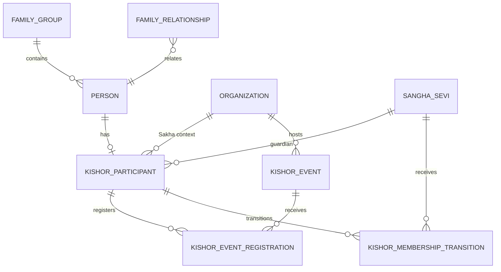
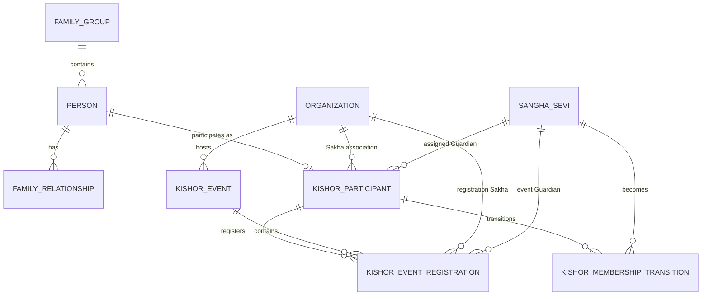
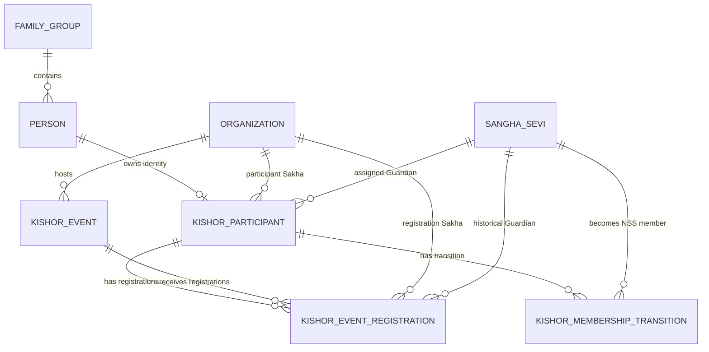

# NSS ERP — Kishor Puja ERD

**Document ID:** SOL-KISH-002  
**Version:** 1.0.0  
**Status:** DRAFT — SOURCE ALIGNED  
**Module:** Kishor Puja  
**Parent System:** Nilachala Saraswata Sangha ERP

---

# 1. Purpose

This document defines the logical Entity Relationship Diagram for the Kishor Puja module.

The ERD represents:

- Kishor participant identity
- Person integration
- Family integration
- Sakha association
- Guardian assignment
- Annual Kishor Puja events
- Event registration
- Year-wise participation
- Future transition to NSS Membership

Kishor Puja is modeled as an annual/event-based participation system rather than as a continuous organizational institution.

---

# 2. Core Kishor Entities

The frozen Kishor model contains four Kishor-specific logical entities:

```text
kishor_participant

kishor_event

kishor_event_registration

kishor_membership_transition
```

This four-entity structure is identified in the project baseline.

---

# 3. Common Foundation Entities

Kishor reuses the common NSS foundation:

```text
person

family_group

family_relationship

organization

sangha_sevi

membership

attendance

governance

audit
```

Kishor shall not create duplicate foundation entities.

---

# 4. High-Level ERD



---

# 5. Entity Ownership

| Entity                          | Owner        | Purpose                    |
| ------------------------------- | ------------ | -------------------------- |
| `person`                        | Person       | Participant identity       |
| `family_group`                  | Family       | Family identity            |
| `family_relationship`           | Family       | Family relationships       |
| `organization`                  | Organization | Sakha/host context         |
| `membership`                    | Membership   | NSS membership             |
| `sangha_sevi`                   | Membership   | NSS member identity        |
| `kishor_participant`           | Kishor      | Permanent KH identity      |
| `kishor_event`                 | Kishor      | Annual Kishor Puja event  |
| `kishor_event_registration`    | Kishor      | Year-specific registration |
| `kishor_membership_transition` | Kishor      | KH → NSS transition        |

---

# 6. `person`

## Purpose

The common Person record is the identity foundation for every Kishor participant.

Conceptually:

```text
PERSON
   |
   +---- Family Relationships
   |
   +---- Kishor Participant
   |
   +---- Future NSS Membership
```

A Kishor participant does not need to already be an NSS Member.

---

# 7. Person-to-Kishor Relationship

The primary relationship is:

```text
PERSON
   1
   |
   |
   0..1
KISHOR_PARTICIPANT
```

One Person may have at most one permanent Kishor participant identity.

That identity may participate in many annual Kishor events.

---

# 8. `kishor_participant`

## Purpose

Represents the permanent Kishor participant identity.

It is the domain anchor for all Kishor Puja history.

---

# 9. `kishor_participant` — Logical Attributes

```text
kishor_participant_pk

kishor_id

person_pk

guardian_sangha_sevi_pk

assigned_by_sakha_pk

guardian_assigned_date

sakha_organization_pk

registration_date

status

remarks

created_at
created_by

updated_at
updated_by
```

The frozen Guardian update specifically identifies:

```text
guardian_sangha_sevi_pk
assigned_by_sakha_pk
guardian_assigned_date
```

as part of the Kishor participant data model.

---

# 10. Kishor Primary Key

```text
kishor_participant_pk
```

is the internal database primary key.

It is not the participant-facing Kishor ID.

---

# 11. Kishor ID

```text
kishor_id
```

is the permanent participant-facing identity.

Example:

```text
KH000001
KH000002
KH000003
```

The same KH ID remains valid across multiple Kishor Puja years.

---

# 12. KH ID Permanence

The relationship is:

```text
PERSON
   |
   ▼
KH000123
   |
   +---- 2026 Kishor Puja
   |
   +---- 2027 Kishor Puja
   |
   +---- 2028 Kishor Puja
```

A new annual event must never generate a new KH ID.

---

# 13. KH ID vs Sangha Sevi ID

The identities remain separate:

```text
KH000123
   ≠
SS000456
```

A later NSS Membership transition may create:

```text
KH000123
     |
     ▼
SS000456
```

The relationship is preserved historically.

The source explicitly freezes the KH → SS transition model.

---

# 14. Sakha Association

Every Kishor registration must be associated with a Sakha for operational ownership and reporting.

The Sakha association is represented through the common Organization framework.

Conceptually:

```text
ORGANIZATION
     |
     | Sakha
     ▼
KISHOR_PARTICIPANT
```

---

# 15. Participant Sakha vs Event Host

These are separate concepts.

```text
Participant's Sakha
        ≠
Event Host Organization
```

A boy may be associated with Sakha A while participating in an event hosted by another authorized organizational context.

The participant's Sakha is not automatically changed by event participation.

---

# 16. Sakha Association Ownership

The Organization module remains authoritative for organizational identity.

Kishor stores the required association/context but does not create a duplicate Sakha master.

No:

```text
kishor_sakha
```

table is required.

---

# 17. Guardian Model

Every Kishor participant must have an assigned Guardian.

The frozen v2.1 rule states:

```text
Guardian
=
NSS Member
+
Member of Participant's Sakha
+
Assigned by Sakha
```

The Guardian is an operational NSS role and is not necessarily the participant's parent.

---

# 18. Guardian Relationship

The operational relationship is:

```text
SANGHA_SEVI
      |
      | Guardian
      ▼
KISHOR_PARTICIPANT
```

The Guardian reference should point to:

```text
sangha_sevi
```

rather than only to `person`.

This is explicitly identified in the frozen Guardian database impact.

---

# 19. Guardian Eligibility

The assigned Guardian must be an NSS Member of the participant's Sakha.

Therefore:

```text
Guardian
   ↓
Sangha Sevi
   ↓
NSS Membership
   ↓
Participant's Sakha
```

---

# 20. Guardian Assignment Authority

The Sakha assigns the operational Guardian.

The ERD therefore preserves:

```text
assigned_by_sakha_pk
```

to identify the Sakha responsible for the assignment.

---

# 21. Guardian Assignment Date

```text
guardian_assigned_date
```

records when the current Guardian assignment became effective.

---

# 22. Guardian History

Guardian assignment is a historical business relationship.

If the Guardian changes, the previous assignment must remain historically traceable.

The final physical history representation shall be finalized in the Business Rules/Table Design documents if a dedicated history structure is required.

---

# 23. Parent vs Guardian

Family relationships and operational Guardian relationships are separate.

```text
Parent
   ≠
Operational Guardian
```

A parent may also be the Guardian only if the person satisfies the frozen Guardian requirement.

---

# 24. Family Integration

Kishor uses the common Family model.

Conceptually:

```text
FAMILY_GROUP
      |
      ▼
PERSON
      |
      ▼
KISHOR_PARTICIPANT
```

The Family module remains authoritative for:

* Family identity
* Parent-child relationships
* Family tree
* Marriage
* Family transitions

---

# 25. Family Visibility

The Family model allows authorized family users to view their own family's Kishor participants.

Potential information includes:

```text
KH ID

Registration Details

Participation History

Guardian Details

Participation Status

Membership Transition Status
```

The frozen Family visibility rule limits family access to the user's own family.

---

# 26. No Duplicate Family Table

Kishor shall not create:

```text
kishor_family

kishor_parent

kishor_family_relationship
```

The common Family module owns those relationships.

---

# 27. `kishor_event`

## Purpose

Represents one annual Kishor Puja occurrence.

Examples:

```text
Kishor Puja 2026
Kishor Puja 2027
Kishor Puja 2028
```

Each annual occurrence is a distinct event.

---

# 28. `kishor_event` — Logical Attributes

```text
kishor_event_pk

event_name

financial_year

event_date

host_organization_pk

location_pk

status

description

remarks

created_at
created_by

updated_at
updated_by
```

The existing frozen source identifies the core event structure around:

```text
kishor_event_pk
event_name
financial_year
event_date
host_organization_pk
```

---

# 29. Event Primary Key

```text
kishor_event_pk
```

uniquely identifies a Kishor Puja occurrence.

The event identity remains permanent even after completion.

---

# 30. Event Year

```text
financial_year
```

provides the year-wise context for Kishor Puja reporting.

Example:

```text
2026
2027
2028
```

---

# 31. Event Date

```text
event_date
```

records the scheduled Kishor Puja date.

---

# 32. Event Host

```text
host_organization_pk
```

identifies the organization responsible for hosting/organizing the event.

The common Organization module remains authoritative.

---

# 33. Event Location

Where a physical location is required, the event shall reference the common Location framework.

Kishor shall not create a separate location master.

---

# 34. Event Status

The event has its own lifecycle independent of participant status.

Possible common event states may include:

```text
DRAFT
PUBLISHED
COMPLETED
CANCELLED
```

The final event status master remains subject to the common Event framework.

---

# 35. Event and Participant Separation

The following are separate:

```text
Kishor Participant
        ≠
Kishor Event
```

A participant can exist even when no current annual event is active.

---

# 36. `kishor_event_registration`

## Purpose

Represents registration of a Kishor participant for a particular Kishor Puja event.

---

# 37. Registration Relationship

```text
KISHOR_PARTICIPANT
       1
       |
       | N
       ▼
KISHOR_EVENT_REGISTRATION
       ▲
       | N
       |
       1
KISHOR_EVENT
```

Therefore:

```text
One Participant
    →
Many Annual Registrations

One Event
    →
Many Participant Registrations
```

---

# 38. `kishor_event_registration` — Logical Attributes

```text
kishor_event_registration_pk

kishor_participant_pk

kishor_event_pk

registration_date

registration_status

sakha_organization_pk

guardian_sangha_sevi_pk

participation_status

remarks

created_at
created_by

updated_at
updated_by
```

The existing project baseline identifies the annual registration relationship as the core mechanism for year-wise participation.

---

# 39. Registration Primary Key

```text
kishor_event_registration_pk
```

uniquely identifies one participant's registration for one Kishor event.

---

# 40. One Registration Per Participant Per Event

A participant shall have at most one active registration for a given Kishor event.

Conceptually:

```text
KH000123
   +
Kishor Puja 2026
   =
One Registration
```

---

# 41. Multiple Years

The same participant may have multiple registrations across years:

```text
KH000123
   |
   +-- Registration → 2026
   |
   +-- Registration → 2027
   |
   +-- Registration → 2028
```

This preserves year-wise participation history.

---

# 42. Registration Does Not Create New KH ID

The registration record never generates a new Kishor ID.

The participant remains:

```text
KH000123
```

across all annual events.

---

# 43. Registration vs Attendance

Registration is not attendance.

```text
Registration
      ≠
Attendance
```

A registered Kishor may or may not attend.

Attendance belongs to the common Attendance framework where applicable.

---

# 44. Participation Status

The registration may preserve event-specific participation status.

This is distinct from the permanent Kishor participant status.

Example:

```text
Kishor Participant
ACTIVE

2026 Registration
REGISTERED
```

---

# 45. Sakha Context on Registration

The registration may preserve the operational Sakha context for the particular event.

This supports:

* Sakha reporting
* Event reporting
* Historical ownership
* Cross-Sangha participation analysis

The authoritative organizational identity remains in the Organization module.

---

# 46. Guardian Context on Registration

The registration may retain the Guardian relevant to that event where required.

This supports year-wise historical reporting if Guardian assignments change between events.

---

# 47. Current Guardian vs Historical Guardian

Two concepts must not be confused:

```text
Current Participant Guardian
        ≠
Guardian Recorded for Historical Event
```

The participant-level Guardian represents the current operational assignment.

The event registration may preserve the Guardian applicable to that event.

---

# 48. Event Participation Across Sakhas

A Kishor participant may participate in an event outside the participant's home Sakha context where permitted.

This does not automatically transfer the participant's Sakha.

---

# 49. Cross-Sakha Event Participation

Conceptually:

```text
Participant
Home Sakha = Sakha A

Kishor Event
Host = Organization/Sakha B

Registration
     ↓
Participation recorded

Home Sakha remains Sakha A
```

This preserves organizational identity separately from event participation.

---

# 50. `kishor_membership_transition`

## Purpose

Records transition from Kishor participation to NSS Membership.

---

# 51. Transition Relationship

```text
KISHOR_PARTICIPANT
        |
        ▼
KISHOR_MEMBERSHIP_TRANSITION
        |
        ▼
SANGHA_SEVI
```

---

# 52. Transition Logical Attributes

```text
transition_pk

kishor_participant_pk

sangha_sevi_pk

transition_date

membership_type_granted

remarks

created_at
created_by

updated_at
updated_by
```

The frozen source identifies the transition around:

```text
transition_pk
kishor_participant_pk
sangha_sevi_pk
transition_date
membership_type_granted
```

---

# 53. Sangha Sevi Ownership

The `sangha_sevi` entity belongs to the common Membership module.

Kishor does not create:

```text
kishor_sangha_sevi
```

---

# 54. NSS Membership Ownership

The common Membership module owns:

* Membership application
* Membership approval
* Membership type
* Membership status
* Sangha Sevi identity

Kishor only records the historical transition relationship.

---

# 55. KH → SS Transition

The lifecycle relationship is:

```text
KH000123
    |
    ▼
NSS Membership Application
    |
    ▼
Membership Approval
    |
    ▼
SS000456
```

The transition record permanently links the two identities.

---

# 56. Transition Is Not Automatic

Kishor participation does not automatically create NSS Membership.

Therefore:

```text
Kishor Participation
        ≠
NSS Membership
```

Membership requires the common Membership approval process.

---

# 57. Membership Type

The transition records the membership type granted.

Examples:

```text
REGULAR_MEMBER

PROBATIONARY_MEMBER
```

The Membership module remains authoritative for the allowable membership types.

---

# 58. Historical Transition

The transition record is permanent historical information.

The system shall preserve:

```text
KH ID

SS ID

Transition Date

Membership Type
```

---

# 59. Complete Relationship Model

```text
                         PERSON
                           |
                           |
                           v
                  KISHOR_PARTICIPANT
                   |       |       |
                   |       |       |
                   |       |       +------------------+
                   |       |                          |
                   |       v                          v
                   |   KISHOR_EVENT_REGISTRATION  GUARDIAN
                   |       ^                          |
                   |       |                          |
                   |       +---- KISHOR_EVENT       |
                   |                                  |
                   |                                  v
                   |                            SANGHA_SEVI
                   |
                   v
          MEMBERSHIP_TRANSITION
                   |
                   v
              SANGHA_SEVI
```

---

# 60. Organization Relationship

```text
ORGANIZATION
    |
    +--------------------+
    |                    |
    v                    v
KISHOR_PARTICIPANT   KISHOR_EVENT
    |
    v
EVENT_REGISTRATION
```

The participant Sakha and event host are separate organizational relationships.

---

# 61. Guardian Relationship

```text
ORGANIZATION / SAKHA
       |
       | assigns
       v
SANGHA_SEVI
       |
       | Guardian
       v
KISHOR_PARTICIPANT
```

The assigned Guardian must be an NSS Member of the participant's Sakha under the frozen v2.1 rule.

---

# 62. Family Relationship

```text
FAMILY_GROUP
     |
     v
PERSON
     |
     v
KISHOR_PARTICIPANT
```

Family access is governed by the Family/RBAC model.

---

# 63. Complete Integration Diagram



---

# 64. Identity Flow

```text
PERSON
   |
   v
KISHOR PARTICIPANT
   |
   v
KH000123
   |
   +---- 2026 Registration
   |
   +---- 2027 Registration
   |
   +---- 2028 Registration
   |
   v
Membership Transition
   |
   v
SS000456
```

---

# 65. Annual Participation Flow

```text
KH000123
    |
    +----------------+
    |                |
    v                v
Kishor Puja 2026  Kishor Puja 2027
    |                |
    v                v
Registration       Registration
    |                |
    v                v
Participation      Participation
```

The KH identity remains unchanged.

---

# 66. Guardian Flow

```text
Kishor Participant
        |
        v
Guardian Required
        |
        v
Sakha Assignment
        |
        v
NSS Member
        |
        v
Guardian Role
```

The operational Guardian is not simply a free-text Person relationship.

---

# 67. Event Ownership Flow

```text
Organization
      |
      v
Kishor Event
      |
      v
Event Registration
      |
      v
Kishor Participant
```

The host organization is distinct from the participant's home Sakha where applicable.

---

# 68. Attendance Integration

The current ERD does not introduce:

```text
kishor_attendance
```

as a Kishor-specific core table.

Where attendance is required:

```text
KISHOR_EVENT
      |
      v
COMMON ATTENDANCE
      |
      v
PERSON / PARTICIPANT
```

The common Attendance module remains authoritative.

---

# 69. Governance Integration

If an event requires governance or responsible-office assignments, the common Governance model shall be reused.

No:

```text
kishor_governing_body
```

table is introduced by this ERD.

---

# 70. Audit Integration

Kishor records shall use the common Audit framework.

No:

```text
kishor_audit
```

table is required.

---

# 71. Security Integration

Kishor uses the common RBAC model.

No:

```text
kishor_role
kishor_permission
```

tables are introduced.

---

# 72. Family Visibility

Family visibility is:

```text
Family
   |
   v
Own Family Members
   |
   v
Kumari / Kishor Information
```

Family users cannot use family visibility to access unrelated Kishor participants.

This rule is frozen.

---

# 73. Sakha Visibility

Sakha-level users may access Kishor participants within their authorized Sakha scope.

The source explicitly freezes:

```text
Sakha Secretary
    ↓
Only their Sakha's boys
```

---

# 74. Kendra Visibility

Kendra-authorized users may view Kishor participants across all Sakhas.

```text
Kendra
   ↓
All Boys
across all Sakhas
```

---

# 75. Guardian Visibility

An assigned Guardian may access authorized information for participants assigned to that Guardian, subject to common RBAC/privacy rules.

---

# 76. No Duplicate Youth Foundation

The current Kishor ERD does not introduce:

```text
youth_participant
youth_program
youth_registration
```

The source contains an earlier proposal for a unified Youth framework, but the later frozen Kishor model retained a separate Kishor event-based design.

---

# 77. Kishor vs Kumari ERD Boundary

Kumari:

```text
kumari_sangha
kumari_membership
kumari_activity
kumari_activity_participant
kumari_membership_transition
```

Kishor:

```text
kishor_participant
kishor_event
kishor_event_registration
kishor_membership_transition
```

They share common foundation entities but remain separate business domains.

---

# 78. Permanent Identity vs Annual Registration

This distinction is fundamental:

```text
Kishor Participant
        =
Permanent Identity

Kishor Event Registration
        =
Year/Event-Specific Record
```

Therefore:

```text
One KH ID
+
Many Annual Registrations
```

---

# 79. Guardian vs Registration

The model supports both:

```text
Participant-Level Guardian
```

and, where required for historical accuracy:

```text
Event Registration Guardian Context
```

This prevents historical event records from changing merely because the current Guardian later changes.

---

# 80. Transition vs Registration

Membership transition is linked to the permanent Kishor participant, not to one particular annual registration.

Therefore:

```text
KISHOR_PARTICIPANT
       |
       +---- Registration 2026
       +---- Registration 2027
       +---- Registration 2028
       |
       +---- Membership Transition
```

---

# 81. No New Identity on Event Change

Changing:

* Event
* Event year
* Host
* Registration
* Guardian
* Participation status

shall not create a new KH identity.

---

# 82. No New Identity on Sakha Context

Changing or updating the participant's organizational context shall not create a new KH identity.

Organizational history belongs to the Organization/relationship model.

---

# 83. No Physical Deletion

Kishor historical records shall not be physically deleted merely because:

* An event is completed
* A registration is cancelled
* A participant stops participating
* A Guardian changes
* The participant later becomes an NSS Member

Historical information remains available subject to privacy and retention rules.

---

# 84. Logical Table Summary

```text
KISHOR DOMAIN

1. kishor_participant
   Permanent KH identity

2. kishor_event
   Annual Kishor Puja

3. kishor_event_registration
   Event/year-specific participation

4. kishor_membership_transition
   KH → NSS Membership transition
```

---

# 85. Common Domain Summary

```text
COMMON FOUNDATION

person
family_group
family_relationship
organization
membership
sangha_sevi
attendance
governance
audit
rbac
```

---

# 86. Relationship Summary

```text
PERSON
  |
  v
KISHOR_PARTICIPANT
  |
  +----< KISHOR_EVENT_REGISTRATION >---- KISHOR_EVENT
  |
  +---- KISHOR_MEMBERSHIP_TRANSITION ----> SANGHA_SEVI
  |
  +---- Guardian ----> SANGHA_SEVI
  |
  +---- Sakha ----> ORGANIZATION

FAMILY_GROUP
  |
  v
PERSON

ORGANIZATION
  |
  +---- Participant Sakha
  |
  +---- Event Host
```

---

# 87. Core Architectural Rules

The ERD preserves these boundaries:

```text
KH ID
    ≠
SS ID

Participant
    ≠
Registration

Registration
    ≠
Attendance

Parent
    ≠
Guardian

Participant Sakha
    ≠
Event Host

Kishor Puja
    ≠
Kumari Sangha

Kishor
    ≠
NSS Membership
```

---

# 88. Future Extension Boundary

The current ERD intentionally does not add dedicated tables for:

```text
kishor_training
kishor_activity
kishor_guardian_history
kishor_assessment
kishor_certificate
```

unless future approved requirements establish that these cannot be adequately represented through existing common/event structures.

---

# 89. Physical Database Boundary

This is a logical ERD.

It does not finalize:

```text
PostgreSQL DDL
CREATE TABLE
CHECK constraints
UNIQUE constraints
Indexes
Triggers
Django migrations
```

Those belong to the physical database design stage.

---

# 90. No SQL Schema in This Document

The project documentation workflow remains:

```text
Authoritative Source
        ↓
Business Rules
        ↓
Solution Overview
        ↓
ERD
        ↓
Lifecycle
        ↓
Table Design
        ↓
Physical Database
```

No SQL is generated as part of this ERD document.

---

# 91. Traceability

This ERD is derived from the current project-source decisions for Kishor Puja, particularly:

```text
KH identity
Annual event model
Sakha-based registration
Guardian assignment
Year-wise participation
Kishor → NSS transition
Family visibility
Sakha/Kendra visibility
```

The frozen Kishor module structure identifies the four Kishor-specific logical tables.

---

# 92. Final ERD



---

# 93. Final Identity Architecture

```text
                         PERSON
                           |
                           v
                  KISHOR PARTICIPANT
                           |
                         KH000123
                           |
              +------------+------------+
              |                         |
              v                         v
      ANNUAL REGISTRATIONS       MEMBERSHIP TRANSITION
              |                         |
              v                         v
      KISHOR EVENTS              SANGHA SEVI
                                        |
                                      SS000456
```

---

# 94. Final Guardian Architecture

```text
Participant's Sakha
       |
       | assigns
       v
NSS Member / Sangha Sevi
       |
       | Guardian
       v
Kishor Participant
```

This reflects the frozen v2.1 Guardian Model.

---

# 95. Status

```text
DOCUMENT STATUS:
DRAFT — SOURCE ALIGNED

VERSION:
1.0.0
```

The current Kishor ERD therefore remains:

```text
Four Kishor-specific entities

+
Common Person / Family / Organization / Membership

+
Permanent KH identity

+
Annual event registration

+
Sakha-assigned NSS Guardian

+
KH → SS transition
```

---

# End of Document
