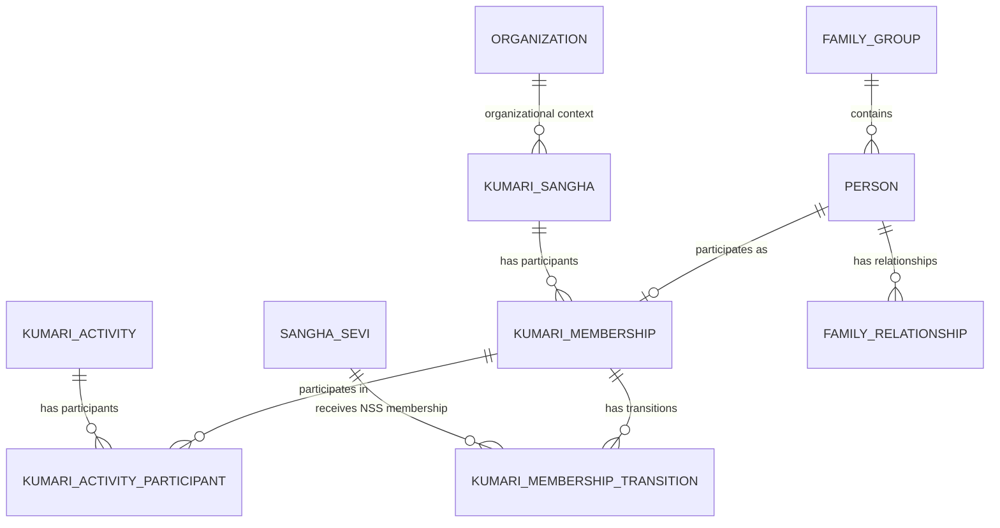
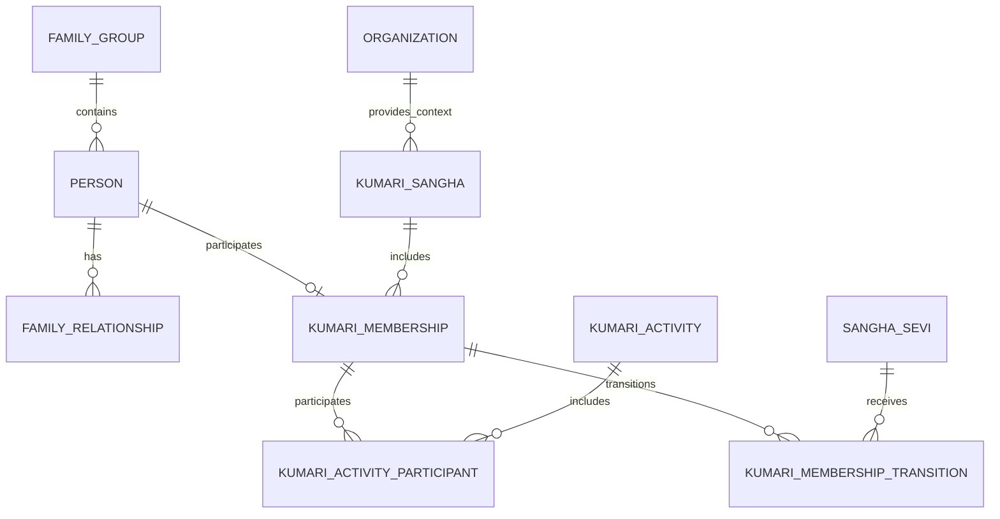

# NSS ERP — Kumari Sangha ERD

**Document ID:** SOL-KUM-002  
**Version:** 1.0.0  
**Status:** DRAFT — SOURCE ALIGNED  
**Module:** Kumari Sangha  
**Parent System:** Nilachala Saraswata Sangha ERP

---

# 1. Purpose

This document defines the logical Entity Relationship Diagram (ERD) for the Kumari Sangha module.

The design represents:

- Kumari Sangha
- Kumari participant identity
- Kumari participation/membership
- Kumari activities
- Activity participation
- Transition to NSS Membership
- Person integration
- Family integration
- Organization/Sakha integration

The design follows the frozen NSS principles:

```text
Person ≠ Member

Kumari ID ≠ Sangha Sevi ID

Participation ≠ NSS Membership

Family First

History Never Deleted

Common Foundation Reuse
```

---

# 2. Core Kumari Entities

The current frozen Kumari logical model contains:

```text
kumari_sangha
kumari_membership
kumari_activity
kumari_activity_participant
kumari_membership_transition
```

These five entities form the core Kumari domain.

---

# 3. Common Foundation Entities

Kumari does not operate independently from the NSS foundation.

It integrates with:

```text
person
family_group
family_relationship
organization
sangha_sevi
membership
```

The common foundation remains owned by the respective modules.

---

# 4. High-Level ERD



---

# 5. Entity Ownership

| Entity                         | Owner        | Kumari Role                         |
| ------------------------------ | ------------ | ----------------------------------- |
| `person`                       | Person       | Participant identity                |
| `family_group`                 | Family       | Family relationship                 |
| `family_relationship`          | Family       | Family linkage                      |
| `organization`                 | Organization | Sakha/Kumari organizational context |
| `membership`                   | Membership   | NSS membership after transition     |
| `sangha_sevi`                  | Membership   | NSS Membership identity             |
| `kumari_sangha`                | Kumari       | Kumari organizational unit          |
| `kumari_membership`            | Kumari       | Kumari participation                |
| `kumari_activity`              | Kumari       | Kumari activity                     |
| `kumari_activity_participant`  | Kumari       | Activity participation              |
| `kumari_membership_transition` | Kumari       | Kumari → NSS transition             |

---

# 6. `person`

The common Person entity is the foundational identity.

Conceptually:

```text
PERSON
  │
  ├── Family Relationships
  │
  ├── Kumari Participation
  │
  └── Future NSS Membership
```

A Kumari participant may exist as a Person without being an NSS member.

This follows the frozen principle:

```text
Person ≠ Member
```

The project source explicitly permits non-member persons such as Kumari participants to exist in the system.

---

# 7. `kumari_sangha`

## Purpose

Represents a Kumari Sangha organizational context.

It provides the organizational association for Kumari participants.

---

## Logical Attributes

```text
kumari_sangha_pk
organization_pk
name
code
status
created_at
updated_at
```

Exact physical columns remain subject to K-05 table design.

---

# 8. `kumari_membership`

## Purpose

Represents a person's participation in Kumari Sangha.

It is intentionally separate from the common NSS Membership entity.

---

## Logical Attributes

```text
kumari_membership_pk
kumari_id
person_pk
kumari_sangha_pk
status
joined_date
exit_date
exit_reason
remarks
```

The frozen source specifically defines this core structure around:

```text
kumari_membership_pk
kumari_id
person_pk
kumari_sangha_pk
status
joined_date
exit_date
exit_reason
```

---

# 9. Kumari ID

`kumari_id` is the Kumari-specific identity.

Example:

```text
KM000001
KM000002
KM000003
```

The identity is:

```text
Unique
Permanent
Never Reused
Valid within Kumari Sangha
```

The Kumari ID is not the NSS Membership ID.

---

# 10. Kumari ID Relationship

The identity model is:

```text
PERSON
   │
   ▼
KUMARI_MEMBERSHIP
   │
   ▼
KM000123
```

Later:

```text
KM000123
   │
   ▼
Approved NSS Membership
   │
   ▼
SS000456
```

Both identities remain historically linked.

---

# 11. Kumari Membership Status

The frozen status/reason model includes:

```text
ACTIVE
MARRIED_OUT
BECAME_NSS_MEMBER
WITHDRAWN
DECEASED
```

These represent Kumari lifecycle states/reasons and must not be confused with NSS Membership status.

---

# 12. Person Relationship

The primary relationship is:

```text
PERSON
    1
    │
    │
    0..1
KUMARI_MEMBERSHIP
```

A Person may participate in Kumari Sangha.

The design does not require the Person to have an NSS Membership record.

---

# 13. Family Integration

Kumari participants may belong to NSS families.

Conceptually:

```text
FAMILY_GROUP
      │
      └── PERSON
             │
             ▼
       KUMARI_MEMBERSHIP
```

The Family module owns:

```text
family_group
family_relationship
family_head_history
family_transition_history
```

Kumari does not duplicate family data.

---

# 14. Family Relationship Example

```text
Family
│
├── Father
│    └── NSS Member
│
├── Mother
│    └── NSS Member
│
└── Daughter
     └── Kumari Participant
         └── KM000123
```

The daughter may have no:

```text
Sangha Sevi ID
NSS Membership
Parichaya Patra
```

while participating in Kumari Sangha.

---

# 15. Organization Relationship

Kumari Sangha uses the common Organization model.

Conceptually:

```text
ORGANIZATION
      │
      ▼
KUMARI_SANGHA
      │
      ▼
KUMARI_MEMBERSHIP
```

The organization may represent the relevant Kumari Sangha/Sakha context.

Exact hierarchy remains owned by Organization.

---

# 16. Sakha Association

Where Kumari participants are associated with a Sakha, the association shall use the common Organization/Sakha framework.

No duplicate:

```text
kumari_sakha
```

table is required.

---

# 17. `kumari_activity`

## Purpose

Represents activities conducted under Kumari Sangha.

Examples may include:

```text
Regular Kumari Activity
Training
Dina-Lipi
Niyam Panchak
Dasa Sheela
Character Building
Spiritual Education
Service-Oriented Activity
```

The final activity taxonomy is master-data driven.

---

# 18. Activity Relationship

```text
KUMARI_SANGHA
      │
      │
      ▼
KUMARI_ACTIVITY
      │
      ▼
KUMARI_ACTIVITY_PARTICIPANT
```

---

# 19. `kumari_activity_participant`

## Purpose

Associates Kumari participants with activities.

This resolves the many-to-many relationship:

```text
KUMARI_MEMBERSHIP
        ↕
KUMARI_ACTIVITY
```

through:

```text
KUMARI_ACTIVITY_PARTICIPANT
```

---

# 20. Activity Participation Relationship

```text
KUMARI_MEMBERSHIP
       1
       │
       │
       N
KUMARI_ACTIVITY_PARTICIPANT
       N
       │
       │
       1
KUMARI_ACTIVITY
```

A Kumari may participate in many activities.

An activity may have many Kumari participants.

---

# 21. Activity Participation Logical Attributes

```text
kumari_activity_participant_pk

kumari_activity_pk

kumari_membership_pk

participation_status

participation_date

remarks

created_at
updated_at
```

The exact final attributes belong to K-05.

---

# 22. Training

Training is represented through the Kumari activity/participation architecture unless a dedicated Training module later requires a separate entity.

Conceptually:

```text
KUMARI_ACTIVITY
      │
      └── activity_type = TRAINING
             │
             ▼
KUMARI_ACTIVITY_PARTICIPANT
```

No separate:

```text
kumari_training_member
```

entity is currently required.

---

# 23. Dina-Lipi

Dina-Lipi participation/tracking belongs to the Kumari domain.

At the ERD level it may be represented through the Kumari activity framework until a detailed Dina-Lipi-specific requirement requires additional entities.

Conceptually:

```text
KUMARI_ACTIVITY
      │
      └── DINA_LIPI
             │
             ▼
KUMARI_ACTIVITY_PARTICIPANT
```

Detailed tracking rules remain for K-04.

---

# 24. Niyam Panchak

Niyam Panchak is part of the Kumari development program.

At the current ERD level:

```text
KUMARI_ACTIVITY
      │
      └── NIYAM_PANCHAK
```

Detailed assessment or completion structures shall not be invented until documented.

---

# 25. Dasa Sheela

Dasa Sheela is part of the Kumari development program.

At the current ERD level:

```text
KUMARI_ACTIVITY
      │
      └── DASA_SHEELA
```

Detailed assessment structures remain subject to later approved requirements.

---

# 26. `kumari_membership_transition`

## Purpose

Records transition from Kumari participation to NSS Membership.

This preserves the historical relationship between:

```text
Kumari ID
```

and:

```text
Sangha Sevi ID
```

---

# 27. Transition Relationship

```text
KUMARI_MEMBERSHIP
       │
       │
       ▼
KUMARI_MEMBERSHIP_TRANSITION
       │
       ▼
SANGHA_SEVI
```

The frozen source explicitly defines the transition around:

```text
transition_pk
kumari_membership_pk
sangha_sevi_pk
transition_date
membership_type_granted
remarks
```

---

# 28. Transition to NSS Membership

The logical flow is:

```text
Kumari Participant
        │
        ▼
Kumari Membership
        │
        ▼
Membership Application
        │
        ▼
NSS Membership Approval
        │
        ▼
Sangha Sevi
        │
        ▼
Sangha Sevi ID
```

The transition record links the two identities.

---

# 29. Sangha Sevi Relationship

`Sangha Sevi` belongs to the common Membership module.

Kumari does not own the Sangha Sevi record.

Therefore:

```text
kumari_membership_transition
          │
          ▼
sangha_sevi
```

is a cross-module relationship.

---

# 30. Membership Type at Transition

The transition record preserves the membership type granted.

Possible values include:

```text
REGULAR_MEMBER
PROBATIONARY_MEMBER
```

The final allowable values are controlled by the common Membership module.

Kumari does not independently define membership types.

---

# 31. Long-Term Participant Transition

The existing frozen rule allows long-term active Kumari participants to be considered for direct Regular Membership, subject to approval.

Therefore the ERD must support both:

```text
Kumari
   ↓
Regular Membership
```

and:

```text
Kumari
   ↓
Probationary Membership
```

where approved.

The transition record captures the actual result.

---

# 32. Marriage Relationship

The current Kumari model includes:

```text
MARRIED_OUT
```

as a Kumari lifecycle status/reason.

The marriage itself belongs to the common Family module.

Therefore:

```text
FAMILY / MARRIAGE
       │
       ▼
KUMARI_MEMBERSHIP.status
       │
       ▼
MARRIED_OUT
```

The Kumari module does not duplicate marriage records.

---

# 33. Withdrawal

A Kumari may leave the program voluntarily.

The Kumari membership record remains.

The status becomes:

```text
WITHDRAWN
```

Historical activity participation remains preserved.

---

# 34. Death

Where the Person is deceased, the Kumari participation lifecycle may record:

```text
DECEASED
```

The Person lifecycle remains owned by the Person module.

The Kumari record remains historical.

---

# 35. Became NSS Member

When NSS Membership is approved:

```text
KUMARI_MEMBERSHIP.status
        =
BECAME_NSS_MEMBER
```

and:

```text
KUMARI_MEMBERSHIP_TRANSITION
        ↓
SANGHA_SEVI
```

is created.

The original `KM...` identity is never reused or deleted.

---

# 36. Historical Identity

The identity history is:

```text
KM000123
     │
     ├── Kumari participation history
     │
     ├── Activities
     │
     ├── Training
     │
     └── Transition
             │
             ▼
        SS000456
             │
             └── NSS Membership history
```

This preserves the person's complete organizational journey.

---

# 37. One Person — Multiple Domain Roles

The same Person may have:

```text
Person
 │
 ├── Family Role
 │
 ├── Kumari Participant
 │
 └── Later NSS Member
```

These are separate domain relationships.

They must not be collapsed into one table.

---

# 38. Attendance Integration

The existing project architecture contains a common Attendance module.

Kumari activity attendance should use the common Attendance architecture where applicable.

Conceptually:

```text
KUMARI_ACTIVITY
       │
       ▼
COMMON ATTENDANCE
       │
       ▼
PERSON / PARTICIPANT
```

A separate:

```text
kumari_attendance
```

table is not currently part of the frozen five-table Kumari model.

---

# 39. Governance Integration

If Kumari Sangha requires governance/coordinator assignments, it shall use the Unified Governance Model.

Potential common structures:

```text
body_master
body_member_assignment
position_master
```

The existing source explicitly recommends common governance structures rather than separate Kumari governance tables.

---

# 40. Finance Integration

Kumari-specific financial requirements, if introduced, shall use the common Finance architecture.

No Kumari finance entity is currently frozen.

---

# 41. Audit Integration

Administrative changes shall use the common Audit framework.

No:

```text
kumari_audit
```

table is required.

---

# 42. RBAC Integration

Kumari access shall use common NSS RBAC.

Authorization is determined through:

```text
User
+
Role
+
Organization Scope
+
Permission
```

No separate Kumari authorization architecture is required.

---

# 43. Family Visibility

The frozen family visibility model allows family members to view authorized participation information concerning their own family members.

For Kumari, this can include:

```text
Participant Details
Activity History
Training History
Participation Status
Membership Transition Status
```

Family access remains restricted to the user's own family.

---

# 44. Kendra Visibility

Authorized Kendra users may access Kumari records across authorized Sakhas/organizations.

The exact permission implementation belongs to RBAC and Organization.

---

# 45. Sakha Visibility

Authorized Sakha users may access Kumari records within their organizational scope.

No separate Kumari permission system is created.

---

# 46. Logical Relationship Summary

```text
PERSON
  │
  │ 1
  │
  └───────────────0..1
              KUMARI_MEMBERSHIP
                    │
                    │ N
                    │
                    ├───────────────┐
                    │               │
                    ▼               ▼
       KUMARI_ACTIVITY_PARTICIPANT  KUMARI_MEMBERSHIP_TRANSITION
                    ▲               │
                    │               │
                    │               ▼
                    │          SANGHA_SEVI
                    │
                    │ N
                    │
                    1
             KUMARI_ACTIVITY
                    │
                    │ N
                    │
                    1
              KUMARI_SANGHA
```

---

# 47. Complete Integration Diagram



---

# 48. Core Data Flow

```text
PERSON
  │
  ▼
FAMILY
  │
  ▼
KUMARI SANGHA
  │
  ▼
KUMARI MEMBERSHIP
  │
  ├──────────────► ACTIVITIES
  │                    │
  │                    ▼
  │             PARTICIPATION
  │
  └──────────────► TRANSITION
                       │
                       ▼
                  NSS MEMBERSHIP
                       │
                       ▼
                  SANGHA SEVI ID
```

---

# 49. Entity Boundary Rules

The following boundaries are mandatory:

```text
Person
    ≠
Kumari Membership

Kumari ID
    ≠
Sangha Sevi ID

Kumari Membership
    ≠
NSS Membership

Activity
    ≠
Membership

Participation
    ≠
Membership

Family
    ≠
Kumari Sangha
```

---

# 50. No Duplicate Foundation Tables

The Kumari module shall not create:

```text
kumari_person
kumari_family
kumari_family_relationship
kumari_sangha_sevi
kumari_nss_membership
```

Common foundation entities shall be reused.

---

# 51. No Duplicate Governance Tables

The Kumari module shall not create:

```text
kumari_governing_body
kumari_governing_body_member
kumari_position_assignment
```

unless a future approved requirement establishes a genuinely Kumari-specific entity that cannot be represented by the common Governance model.

---

# 52. No Duplicate Attendance Table

The current ERD does not introduce:

```text
kumari_attendance
```

Attendance remains a common capability.

---

# 53. No Duplicate Finance Table

The current ERD does not introduce:

```text
kumari_finance
```

Finance remains a common capability.

---

# 54. Five Core Kumari Entities

The current Solution ERD therefore centers on:

```text
1. kumari_sangha

2. kumari_membership

3. kumari_activity

4. kumari_activity_participant

5. kumari_membership_transition
```

This matches the existing frozen project architecture.

---

# 55. Entity Ownership Summary

```text
COMMON
────────────────────────────
person
family_group
family_relationship
organization
membership
sangha_sevi
attendance
governance
finance
audit

KUMARI
────────────────────────────
kumari_sangha
kumari_membership
kumari_activity
kumari_activity_participant
kumari_membership_transition
```

---

# 56. Future Extension Boundary

The ERD intentionally leaves room for future dedicated entities if approved requirements demand them.

Potential future areas:

```text
Dina-Lipi detailed tracking
Niyam Panchak assessment
Dasa Sheela assessment
Training certification
Kumari governance
Advanced activity evaluation
```

These are not added to the current ERD without an approved business requirement.

---

# 57. Design Principle

The ERD follows:

```text
Business Requirement
        ↓
Logical Entity
        ↓
Relationship
        ↓
Common Module Reuse
        ↓
Physical Table Design
```

A business concept does not automatically require a new physical table.

---

# 58. Status

```text
DOCUMENT STATUS:
DRAFT — SOURCE ALIGNED

VERSION:
1.0.0
```

The current ERD is aligned with the frozen Kumari architecture:

```text
Kumari ID ≠ Sangha Sevi ID

Kumari Participation ≠ NSS Membership

Five Core Kumari Entities

Common Person / Family / Organization Reuse

Historical Transition Preservation
```

---

# End of Document
