# NSS ERP — Membership Module ERD

---

## Document Metadata

| Item | Value |
|---|---|
| Document Name | Membership Module ERD |
| Document ID | SOL-MEM-002 |
| Domain | Membership |
| Repository Path | docs/03_Solution/modules/membership/02_membership_erd.md |
| Version | 1.1.0 |
| Status | Draft |
| Authority | NSS ERP Membership Module |
| Parent Document | 01_membership_module_overview.md |
| Related Documents | 03_membership_lifecycle.md, 04_membership_business_rules.md, 05_membership_table_design.md |
| Effective Date | TBD |

---

# 1. Purpose

This document defines the Entity Relationship Diagram (ERD) for the NSS ERP Membership Module.

The ERD translates the approved Membership Module principles and business rules into a logical data relationship model.

The model is based on the following principles:

- Person is separate from Membership.
- One Person may exist without Membership.
- One Person may have only one Membership.
- One Membership belongs to exactly one Person.
- Membership identity is represented by the Sangha Sevi ID.
- Sangha Sevi ID is permanent and never reused.
- Membership history shall never be physically deleted.
- Membership type and membership status are separate concepts.
- Membership transfers preserve the Sangha Sevi ID.
- Membership renewals preserve the Sangha Sevi ID.
- Attendance review does not itself change Membership status.
- Official Membership Types are PROBATIONARY, REGULAR and ASSOCIATE.

---

# 2. Core Membership Relationship

The fundamental relationship is:

```text
Person
   |
   | 1
   |
   | 0..1
   v
Membership / Sangha Sevi
```

This implements:

```text
One Person
    |
One Membership
    |
One Sangha Sevi ID
```

A Person may exist without a Membership.

A Membership cannot exist without a Person.

---

# 3. Membership Identity

The primary business identity of a Membership is the Sangha Sevi ID.

Example:

```text
SS00000001
SS00000002
SS00000003
```

The Sangha Sevi ID shall be:

* System generated.
* Globally unique.
* Permanent.
* Never reused.
* Never changed.

The internal database primary key remains separate from the human-readable Sangha Sevi ID.

## 3.1 Local Sakha ERP ID (MEM-PENDING-001 — annotation only)

In addition to the NSS-wide Sangha Sevi ID, each member holds a
**Local Sakha ERP ID** scoped to their recognized/base Sakha. The
conceptual rules are frozen in CROSS_MODULE_PRINCIPLES.md §20.2
(MEM-PENDING-001). Key properties:

```text
Format:  <3–5 character Organization/Sakha Short Code><8-digit sequence>
Example: EKM00000123
```

* One active Local Sakha ERP ID per member, issued by the
  recognized/base Sakha.
* "Darshak" is an operational term covering two distinct categories:
  - **New Probationary Member** (operationally called "Darshak") — does
    not hold a Parichaya Patra from another Sangha. **Receives a new
    Local Sakha ERP ID** from the Sakha where membership is being
    established.
  - **Approved Darshak** (existing member of another Sangha) — already
    holds a recognized Parichaya Patra elsewhere. **Does not receive a
    second Local Sakha ERP ID**; uses their base-Sakha ID.
* On transfer: old ID is archived (never reassigned to another
  person); new Sakha issues the next number in its sequence.
* On return to the same Sakha: the same person's archived ID may be
  reactivated rather than issuing a new one.
* Legacy Sakha register numbers are distinct from the ERP-issued ID
  and require a migration mapping.

**Physical representation** — whether Local Sakha ERP ID lives on
`sangha_sevi`, on a candidate `membership_sakha_affiliation` table,
or elsewhere — is **not frozen** and remains a Membership DDL-phase
decision. See §12.1 and CROSS_MODULE_PRINCIPLES.md §20.2.

---

# 4. Logical ERD

```mermaid
erDiagram

    PERSON ||--o| SANGHA_SEVI : "has membership"

    SANGHA_SEVI }o--|| MEMBERSHIP_TYPE : "has type"

    SANGHA_SEVI }o--|| MEMBERSHIP_STATUS : "has status"

    SANGHA_SEVI ||--o{ MEMBERSHIP_STATUS_HISTORY : "has status history"

    SANGHA_SEVI ||--o{ MEMBERSHIP_RENEWAL_REQUEST : "creates"

    SANGHA_SEVI ||--o{ MEMBERSHIP_RENEWAL_HISTORY : "has renewals"

    SANGHA_SEVI ||--o{ MEMBERSHIP_TRANSFER_HISTORY : "has transfers"

    SANGHA_SEVI ||--o{ MEMBERSHIP_JOURNEY_EVENT : "has journey events"

    SANGHA_SEVI ||--o{ PROBATIONARY_MEMBER_REVIEW : "has reviews"

    SANGHA_SEVI ||--o{ PARICHAYA_PATRA : "may have"

    PARICHAYA_PATRA ||--o{ PARICHAYA_PATRA_HISTORY : "has history"

    SANGHA_SEVI ||--o{ ANUMATI_PATRA : "may have"

    ANUMATI_PATRA ||--o{ ANUMATI_PATRA_HISTORY : "has history"

    ORGANIZATION ||--o{ SANGHA_SEVI : "current membership organization"

    PERSON {
        uuid person_pk PK
        string person_id UK
    }

    SANGHA_SEVI {
        uuid sangha_sevi_pk PK
        string sangha_sevi_id UK
        uuid person_pk FK
        uuid membership_type_pk FK
        uuid membership_status_pk FK
        uuid organization_pk FK
        date joining_date
        date renewal_due_date
    }

    MEMBERSHIP_TYPE {
        uuid membership_type_pk PK
        string code UK
        string name
    }

    MEMBERSHIP_STATUS {
        uuid membership_status_pk PK
        string code UK
        string name
    }

    MEMBERSHIP_STATUS_HISTORY {
        uuid membership_status_history_pk PK
        uuid sangha_sevi_pk FK
        uuid membership_status_pk FK
        date effective_from
        date effective_to
    }

    MEMBERSHIP_RENEWAL_REQUEST {
        uuid membership_renewal_request_pk PK
        uuid sangha_sevi_pk FK
        date requested_date
        string status
    }

    MEMBERSHIP_RENEWAL_HISTORY {
        uuid membership_renewal_history_pk PK
        uuid sangha_sevi_pk FK
        date renewal_date
        date valid_from
        date valid_to
    }

    MEMBERSHIP_TRANSFER_HISTORY {
        uuid membership_transfer_history_pk PK
        uuid sangha_sevi_pk FK
        uuid old_organization_pk FK
        uuid new_organization_pk FK
        date requested_date
        date approved_date
        date effective_date
    }

    MEMBERSHIP_JOURNEY_EVENT {
        uuid membership_journey_event_pk PK
        uuid sangha_sevi_pk FK
        string event_type
        date event_date
    }

    PROBATIONARY_MEMBER_REVIEW {
        uuid probationary_member_review_pk PK
        uuid sangha_sevi_pk FK
        date review_date
        string outcome
    }

    PARICHAYA_PATRA {
        uuid parichaya_patra_pk PK
        uuid sangha_sevi_pk FK
    }

    PARICHAYA_PATRA_HISTORY {
        uuid parichaya_patra_history_pk PK
        uuid parichaya_patra_pk FK
    }

    ANUMATI_PATRA {
        uuid anumati_patra_pk PK
        uuid sangha_sevi_pk FK
    }

    ANUMATI_PATRA_HISTORY {
        uuid anumati_patra_history_pk PK
        uuid anumati_patra_pk FK
    }

    ORGANIZATION {
        uuid organization_pk PK
        string organization_id UK
    }
```



---

# 5. Membership Type

The authoritative Membership categories are:

```text
PROBATIONARY
REGULAR
ASSOCIATE
```

The ERP shall not use:

```text
DARSHAK
FULL_MEMBER
```

as database Membership Type values.

"Darshak" is an approved operational/UI term only and is defined separately in:

```text
docs/03_Solution/modules/attendance/DARSHAK_BUSINESS_RULE.md
```

---

# 6. Membership Status

Membership Type and Membership Status are independent.

Example Membership Types:

```text
PROBATIONARY
REGULAR
ASSOCIATE
```

Membership Status represents the current state of the Membership.

The module overview identifies examples including:

```text
ACTIVE
RENEWAL_PENDING
EXPIRED
SUSPENDED
ON_HOLD
DISCIPLINARY_REVIEW
TRANSFERRED
DECEASED
```

The final master-data values shall remain controlled through the Membership Status master.

---

# 7. Membership Status History

Every significant Membership status transition shall be historically traceable.

Example:

```text
ACTIVE
   |
RENEWAL_PENDING
   |
ACTIVE
```

or:

```text
ACTIVE
   |
DISCIPLINARY_REVIEW
```

The historical record shall not be physically deleted.

---

# 8. Renewal Relationship

A Membership may have multiple renewal requests and renewal history records.

```text
Sangha Sevi
    |
    +-- Renewal Request
    +-- Renewal History
    +-- Renewal Request
    +-- Renewal History
```

The Sangha Sevi ID remains unchanged.

---

# 9. Transfer Relationship

A Membership may have multiple transfer history records.

```text
Sangha Sevi
    |
    +-- Transfer History
          |
          +-- Old Sakha
          +-- New Sakha
          +-- Approval
          +-- Effective Date
```

Transfer does not create a new Sangha Sevi ID.

### Local Sakha ERP ID on Transfer (MEM-PENDING-001 annotation)

Transfer archives the old Local Sakha ERP ID and the new Sakha issues
the next number in its sequence. The old ID is never reassigned to
another person. If the member later returns to the same Sakha, their
previously archived ID may be reactivated.

`membership_transfer_history` continues to store `old_local_sakha_number`
/ `new_local_sakha_number` as historical transition snapshots. The
authoritative current Local Sakha ERP ID belongs to the member's active
Sakha-affiliation period — physical placement is a DDL-phase decision
(see §12.1).

Note: an existing-member Approved Darshak attending another Sakha does
not trigger a transfer and does not receive a second Local Sakha ERP
ID. A new Probationary Member (operationally also called "Darshak")
**does** receive a Local Sakha ERP ID from the enrolling Sakha — see
MEM-PENDING-001 rule 5.

---

# 10. Probationary Review

Probationary progression requires preservation of review history.

```text
Probationary Member
       |
Review
       |
Training / Eligibility
       |
Regular Membership
```

The review history shall remain preserved.

---

# 11. Identity Documents

The Membership domain maintains first-class relationships with:

```text
Anumati Patra
Parichaya Patra
```

Their historical versions are retained.

---

# 12. Organization Relationship

The Membership record maintains the current organizational association.

Historical organizational changes are preserved through:

```text
membership_transfer_history
```

A transfer therefore does not overwrite the historical relationship.

## 12.1 Candidate: Membership Sakha Affiliation History (MEM-PENDING-001 annotation)

`membership_transfer_history` records transfer events; it does not
necessarily serve as the complete effective-dated affiliation history.
CROSS_MODULE_PRINCIPLES.md §20.2 identifies a **candidate** structure
— a Membership-owned `membership_sakha_affiliation` table (or
equivalent) — that would provide:

* Authoritative effective-dated recognized-Sakha relationships
  (from initial enrollment onward, not just transfer events).
* A natural per-period home for the Local Sakha ERP ID.
* Source-event classification (ENROLLMENT / TRANSFER / REACTIVATION).
* An authoritative Sakha-period history that downstream modules
  (including Sevak's `sevak_sakha_association`) can consume.

```text
SANGHA_SEVI
    |
    +-- MEMBERSHIP_TRANSFER_HISTORY         (transfer event record — exists)
    |
    +-- MEMBERSHIP_SAKHA_AFFILIATION (?)    (candidate — DDL-phase decision)
              |
              +-- Sakha (organization_pk)
              +-- Effective period
              +-- Local Sakha ERP ID
              +-- Source event
              +-- Affiliation status
```

**This entity is a DDL-phase candidate, not a frozen design element.**
Whether it is physically created, merged with transfer history, or
handled differently is a Membership DDL-phase decision. The
relationship between this candidate structure and the Sevak module's
`sevak_sakha_association` is explicitly deferred — see
CROSS_MODULE_PRINCIPLES.md §20.2.

---

# 13. Deletion Principle

Membership records shall not be physically deleted.

Historical records shall remain available for:

* Audit.
* Reporting.
* Governance review.
* Membership history.
* Transfer history.
* Renewal history.
* Identity-document history.

---

# 14. ERD Design Principles

The ERD follows:

```text
Person is not equal to Member

Membership ID = Sangha Sevi ID

History Never Deleted

Master Data Driven

By-Law Supremacy

Auditability
```

### Pending Architectural Decisions

The following items from CROSS_MODULE_PRINCIPLES.md affect the
Membership ERD but are not yet resolved at the physical level:

| Decision | Reference | Status |
|---|---|---|
| Local Sakha ERP ID physical placement | MEM-PENDING-001 (§20.2) | Conceptual rules FROZEN; physical schema PENDING |
| Candidate `membership_sakha_affiliation` entity | MEM-PENDING-001 (§20.2) | DDL-phase candidate — not frozen |
| Relationship to Sevak `sevak_sakha_association` | MEM-PENDING-001 (§20.2) | Explicitly deferred to Membership DDL phase |
| Legacy Sakha register number migration mapping | MEM-PENDING-001 (§20.2) | Unfrozen |

These annotations are forward references only. No ERD entity, column,
or relationship is added or removed by this annotation.


