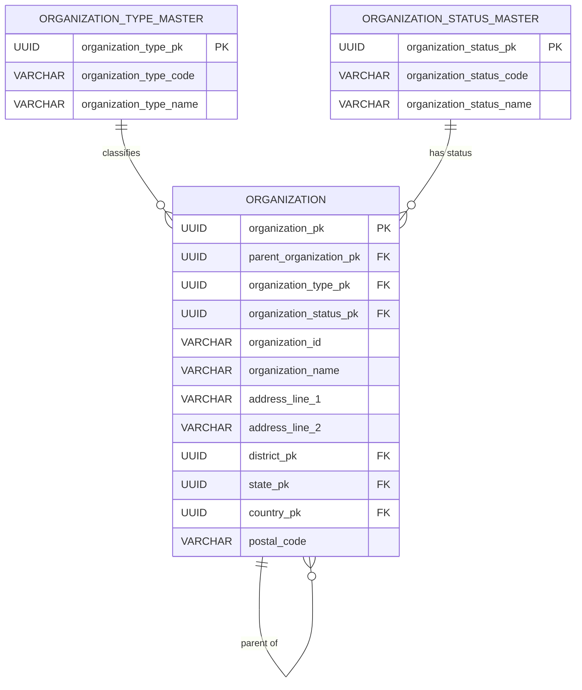
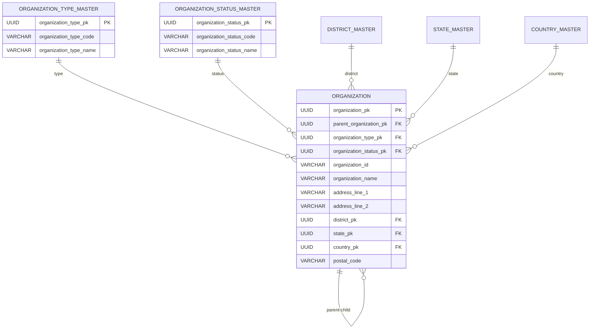
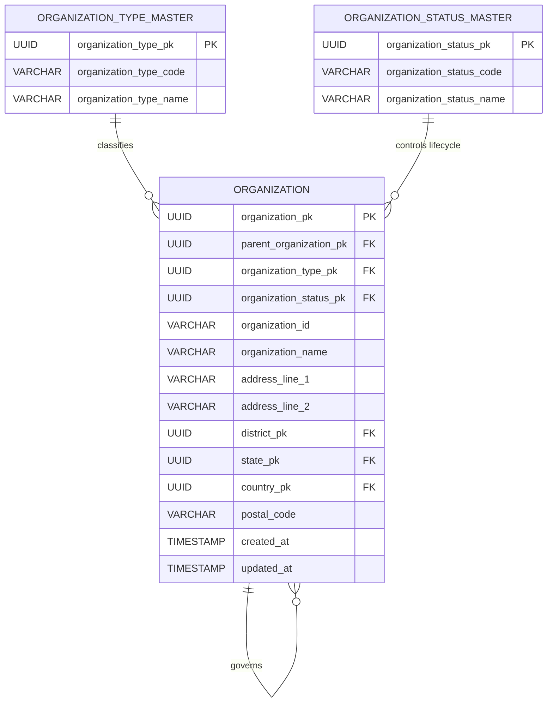

# NSS ERP — Organization ERD

**Document ID:** SOL-ORG-002
**Version:** 1.0.0
**Status:** DRAFT — SOURCE ALIGNED
**Module:** Organization
**Parent System:** Nilachala Saraswata Sangha ERP

---

# 1. Purpose

This document defines the logical Entity Relationship Diagram (ERD)
for the NSS ERP Organization Module.

The ERD represents:

- Organizational types
- Organizational statuses
- Organizational units
- Parent-child hierarchy
- Organizational lineage
- Organizational address

The ERD does not define PostgreSQL DDL or physical SQL implementation.

---

# 2. Current Frozen Scope

The current Organization foundation contains:

1. `organization_type_master`
2. `organization_status_master`
3. `organization`

The current design does not introduce a separate:

```text
organization_hierarchy
organization_address
```

table.

The parent-child hierarchy is represented directly through the
`organization` entity, and the current organization address is stored
directly within `organization`.

---

# 3. ERD Overview



---

# 4. Core Relationship Model

The Organization Module has three primary relationships:

```text
organization_type_master
             |
             | 1:N
             ▼
       organization
             ▲
             | 1:N self hierarchy
             |
       parent organization

organization_status_master
             |
             | 1:N
             ▼
       organization
```

---

# 5. Organization Type Relationship

Relationship:

```text
ORGANIZATION_TYPE_MASTER
          1
          |
          N
          |
    ORGANIZATION
```

One organization type may classify multiple organizations.

Each organization belongs to one organization type.

---

# 6. Organization Type Foreign Key

Logical relationship:

```text
organization.organization_type_pk
        ↓
organization_type_master.organization_type_pk
```

Organization type is controlled through the master table.

---

# 7. Organization Status Relationship

Relationship:

```text
ORGANIZATION_STATUS_MASTER
          1
          |
          N
          |
    ORGANIZATION
```

One status may apply to many organizational units.

Each organization has one current organizational status.

---

# 8. Organization Status Foreign Key

Logical relationship:

```text
organization.organization_status_pk
        ↓
organization_status_master.organization_status_pk
```

Status values are controlled through the status master.

---

# 9. Organization Self-Relationship

The organization hierarchy is represented through a self-referencing relationship:

```text
ORGANIZATION
     1
     |
     | parent
     |
     N
ORGANIZATION
```

Conceptually:

```text
Parent Organization
        |
        +---- Child Organization
                  |
                  +---- Child Organization
```

---

# 10. Parent Organization

Every non-apex organization shall reference exactly one parent organization.

Logical relationship:

```text
organization.parent_organization_pk
        ↓
organization.organization_pk
```

The parent organization is another record in the same `organization` table.

---

# 11. Apex Organization

The apex organization is the root of the organizational hierarchy.

It has:

```text
parent_organization_pk = NULL
```

The production hierarchy shall contain exactly one such apex organization.

The Governance Standard explicitly requires a single apex organizational root.

---

# 12. Non-Apex Organization

Every non-apex organization shall have:

```text
parent_organization_pk
```

pointing to a valid organization.

Therefore:

```text
Apex
  └── parent = NULL

Non-Apex
  └── parent = valid organization
```

---

# 13. Parent-Child Cardinality

A parent organization may have zero or many child organizations.

Therefore:

```text
One Parent
    ↓
Zero or Many Children
```

Each child has exactly one parent unless it is the apex.

---

# 14. No Multiple Parents

An organization cannot have:

```text
Parent A
+
Parent B
```

simultaneously within the statutory hierarchy.

The source explicitly prohibits multiple parent assignments. 

---

# 15. No Orphan Organizations

A non-apex organization cannot exist without a valid parent.

Invalid:

```text
Organization
    |
    └── parent = NULL
```

unless the organization is the single apex.

---

# 16. No Circular Relationships

The hierarchy must not contain cycles.

Invalid example:

```text
A
 ↓
B
 ↓
C
 ↓
A
```

Circular organizational references are explicitly prohibited.

---

# 17. Organizational Lineage

The self-referencing hierarchy allows complete lineage to be traversed:

```text
Organization
     ↓
Parent
     ↓
Parent's Parent
     ↓
...
     ↓
Apex
```

The ERP shall preserve this lineage throughout the organization's lifecycle.

---

# 18. Organizational Type

`organization_type_master` identifies what type of organizational unit a record represents.

Conceptually:

```text
organization
      |
      └── organization_type
```

The exact statutory organization types shall be derived from authoritative NSS references.

The ERP shall not invent statutory organizational levels.

---

# 19. Organizational Status

`organization_status_master` identifies the current lifecycle state of an organization.

Conceptually:

```text
organization
      |
      └── organization_status
```

The governance standard identifies typical lifecycle states including:

```text
PROPOSED
APPROVED
ACTIVE
INACTIVE
ARCHIVED
```

The detailed transition rules belong to the Organization Lifecycle document. 

---

# 20. Organization Identity

Every organization has a permanent internal identity:

```text
organization.organization_pk
```

and a permanent business/system identifier:

```text
organization.organization_id
```

The identifier must remain:

* Unique
* Immutable
* Never reused
* Consistent across ERP modules

This is explicitly required by GOV-DATA-004. 

---

# 21. Organization Name

The organization record contains the organization's human-readable name.

The name is not the permanent identity.

Therefore:

```text
organization_id
        ≠
organization_name
```

The identifier remains stable even if an approved organizational name correction occurs.

---

# 22. Organization Address

The current design places the organization's current address directly in `organization`.

Conceptually:

```text
ORGANIZATION
    |
    ├── address_line_1
    ├── address_line_2
    ├── district_pk
    ├── state_pk
    ├── country_pk
    └── postal_code
```

This is the revised v1 design. 

---

# 23. Organization Address Relationship

Where location master tables are used:

```text
organization.district_pk
        ↓
district_master

organization.state_pk
        ↓
state_master

organization.country_pk
        ↓
country_master
```

These are common Foundation/Location domains.

They are not Organization-owned master tables.

---

# 24. No `organization_address`

The current ERD deliberately excludes:

```text
organization_address
```

The source explicitly revised the design from:

```text
organization
      1
      |
      N
organization_address
```

to:

```text
organization
```

with address columns directly on the organization record. 

---

# 25. Address Cardinality

Current v1 rule:

```text
One Organization
       ↓
Zero or One Current Address
```

There is no multiple-address relationship in the current design.

---

# 26. No Address History

The current Organization scope does not contain:

```text
organization_address_history
```

or any other dedicated address-history table.

---

# 27. Organization Types (FROZEN)

The frozen organization type list (8 types, decided 2026-08-28):

```text
KENDRA          = Central Body (unique)
NILACHALA_KUTIRA = Spiritual Residence (unique)
SMRUTI_MANDIRA  = Memorial Temple (unique)
ANCHALIKA       = Administrative Unit (multiple)
ZILLA           = Administrative Unit (multiple)
SAKHA           = Physical Sangha Location (multiple)
SAKHA_ASANA     = Approved Sakha, no own building (multiple)
PATHA_CHAKRA    = Study Circle (multiple)
```

Therefore the ERD must not assume that every organization type requires a physical address in the same manner. 

---

# 28. Sakha Address

Where an organization represents a physical Sakha, the organization address fields may contain its physical location.

---

# 29. Anchalika / Zilla Address

Anchalika and Zilla are administrative organizational units.

The ERD does not impose a physical-address requirement merely because they are organizational records.

---

# 30. Organization Type Does Not Create Separate Tables

The current design does not create separate tables such as:

```text
sakha_sangha
mahila_sangha
sikshya_kendra
sakha_asana
paribarik_asana
patha_chakra
```

merely because they represent different organizational concepts.

Where an entity is represented as an Organization, its identity remains in the common `organization` table.

---

# 31. Specialized Module Boundary

Specialized modules may contain domain-specific data associated with organizations.

However:

```text
Organization Identity
        ↓
Organization Module
```

remains authoritative.

A specialized module shall not create a duplicate organizational master.

---

# 32. Mahila Relationship

The Mahila module may maintain Mahila-specific organizational/governance information.

The common organizational identity remains represented through the Organization framework where applicable.

The current Mahila-specific business rules do not alter the core Organization ERD.

---

# 33. Sevak Relationship

Sevak operations may use organizational scope.

The Sevak module shall reference the Organization framework rather than create a parallel organizational hierarchy.

---

# 34. Membership Relationship

Membership records may reference organizational context.

Membership remains responsible for membership identity and lifecycle.

Organization remains responsible for the organizational entity.

---

# 35. Person Relationship

Person identity is owned by the Person Module.

The Organization ERD does not create a Person entity.

A Person may interact with organizations through other domain relationships.

---

# 36. Governance Relationship

Governance records may reference organizations.

The Governance Module owns:

```text
Governing Body
Positions
Office-Bearer Assignments
Terms
Elections
```

The Organization Module owns the organization itself.

---

# 37. Attendance Relationship

Attendance may be calculated or reported within organizational scope.

Attendance does not alter the Organization hierarchy.

---

# 38. RBAC Relationship

RBAC may use organizational scope.

Conceptually:

```text
User / Role
      |
      └── Organizational Scope
                |
                ▼
          Organization
```

The RBAC relationship is owned by the Authentication/Administration domain.

---

# 39. Organizational Scope Traversal

The self-referencing organization hierarchy enables scope traversal:

```text
Apex
 ↓
Child
 ↓
Grandchild
 ↓
Sakha
```

Reports and permissions may use this lineage.

---

# 40. Organizational Hierarchy Example

Illustrative structure:

```text
Apex Organization
│
├── Organization A
│   │
│   ├── Organization A1
│   └── Organization A2
│
└── Organization B
    │
    └── Organization B1
```

This diagram illustrates the relationship model only.

It does not define statutory organization types.

---

# 41. ERD With Location Dependencies



The location entities shown above are common Foundation dependencies, not additional Organization Module tables.

---

# 42. Logical Dependency Model

```text
                 COMMON FOUNDATION
                       │
          ┌────────────┼────────────┐
          │            │            │
          ▼            ▼            ▼
       Country       State       District
          │            │            │
          └────────────┼────────────┘
                       │
                       ▼
                ORGANIZATION
                       │
          ┌────────────┼────────────┐
          │            │            │
          ▼            ▼            ▼
       Type          Status       Parent
       Master        Master         │
                                    │
                                    ▼
                              Organization
```

---

# 43. Complete Organization ERD



---

# 44. Relationship Summary

| Relationship                       | Cardinality | Meaning                                  |
| ---------------------------------- | ----------- | ---------------------------------------- |
| Organization Type → Organization   | 1:N         | One type classifies many organizations   |
| Organization Status → Organization | 1:N         | One status applies to many organizations |
| Organization → Organization        | 1:N         | One parent may have many children        |
| Organization → Country             | N:1         | Organization may reference country       |
| Organization → State               | N:1         | Organization may reference state         |
| Organization → District            | N:1         | Organization may reference district      |

---

# 45. Apex Constraint

The ERD requires:

```text
Exactly One Apex
        ↓
parent_organization_pk IS NULL
```

All other organizations must have a parent.

---

# 46. Hierarchy Integrity

The logical model must guarantee:

```text
One Root
No Cycles
No Orphans
One Parent per Non-Apex
Complete Lineage
```

These are governance requirements, not merely UI behavior.

---

# 47. Parent Validation

A parent organization must:

* Exist
* Be a valid organization
* Not create a circular hierarchy
* Remain statutorily valid

---

# 48. Parent Type Validation

Whether a particular organization type may parent another organization type shall be determined from authoritative organizational rules.

The ERD does not invent a type-to-type hierarchy matrix.

---

# 49. Organizational Level

The Governance Standard refers to hierarchical level as part of organizational relationships.

The current ERD does not introduce a separate `organization_level_master` because the current three-table Organization scope does not establish such a table.

Where hierarchical level is required, it shall be derived from the approved organizational model or added only through a separately approved design change.

---

# 50. No `organization_hierarchy` Table

The current design does not create:

```text
organization_hierarchy
```

The hierarchy is represented by:

```text
organization.parent_organization_pk
```

---

# 51. No Duplicate Hierarchy

The application shall not maintain a second hierarchy representation that can diverge from the `organization` parent relationship.

---

# 52. Historical Integrity

Organizational identity remains permanent.

If organizational status or hierarchy changes through approved governance procedures, the organization itself is not recreated merely to represent the change.

Historical traceability is maintained through the common audit/history framework.

---

# 53. Organizational Status and Hierarchy

Changing status does not inherently change parentage.

Changing parentage is a separate organizational governance action.

---

# 54. Organizational Identity and Name

Changing an organization's name does not create a new organization if the underlying organizational identity remains the same.

The permanent organization identifier remains stable.

---

# 55. ERD Boundary

The Organization ERD owns:

```text
Organizational Identity
Organizational Type
Organizational Status
Parent-Child Relationship
Organizational Address
```

It does not own:

```text
Person
Membership
Governance Position
Attendance
Sevak Participation
Mahila Participation
Document Storage
Authentication
RBAC
```

---

# 56. Future Extension Boundary

Potential future Organization structures shall not be introduced into this ERD unless supported by authoritative requirements or approved implementation decisions.

The current source does not authorize separate Organization tables merely for convenience.

---

# 57. Physical Database Boundary

This is a logical ERD.

It does not define:

```text
CREATE TABLE
ALTER TABLE
FOREIGN KEY SQL
CHECK CONSTRAINT SQL
INDEX SQL
TRIGGER SQL
Django Migration
```

Those belong to the later physical database stage.

---

# 58. Database Enforcement Requirement

Although SQL is not defined here, the Governance Standard requires parent-child integrity to be enforced through:

```text
Database Constraints
+
Application Validation
```

This includes preventing:

* Multiple parents
* Circular references
* Orphan units
* Invalid parent references

---

# 59. Final Logical Model

```text
                  ORGANIZATION_TYPE_MASTER
                            │
                            │ 1:N
                            ▼
                       ORGANIZATION
                            ▲
                            │
                            │ N:1
                  ORGANIZATION_STATUS_MASTER

                       ORGANIZATION
                            │
                            │ self-reference
                            ▼
                       ORGANIZATION
                       Parent → Child
```

with optional location references:

```text
organization
    ├── country
    ├── state
    └── district
```

---

# 60. Final Table Count

```text
Organization Module
────────────────────
1. organization_type_master
2. organization_status_master
3. organization

TOTAL = 3
```

---

# 61. Final ERD Principles

```text
✓ One statutory apex

✓ Apex has no parent

✓ Every non-apex organization has exactly one parent

✓ Parent-child relationship is self-referencing

✓ No circular relationships

✓ No orphan organizations

✓ Complete lineage to apex

✓ Permanent organization identity

✓ Immutable organization identifier

✓ Organization type is master-driven

✓ Organization status is master-driven

✓ Current address is directly on organization

✓ No organization_address table

✓ No organization_hierarchy table

✓ Common Location Masters are reused

✓ Specialized modules do not duplicate organization identity

✓ Governance owns current governance assignments

✓ Person owns person identity

✓ Membership owns membership lifecycle

✓ No SQL schema is defined here
```

---

# 62. Status

```text
DOCUMENT STATUS:
DRAFT — SOURCE ALIGNED

VERSION:
1.0.0
```

---

# End of Document
