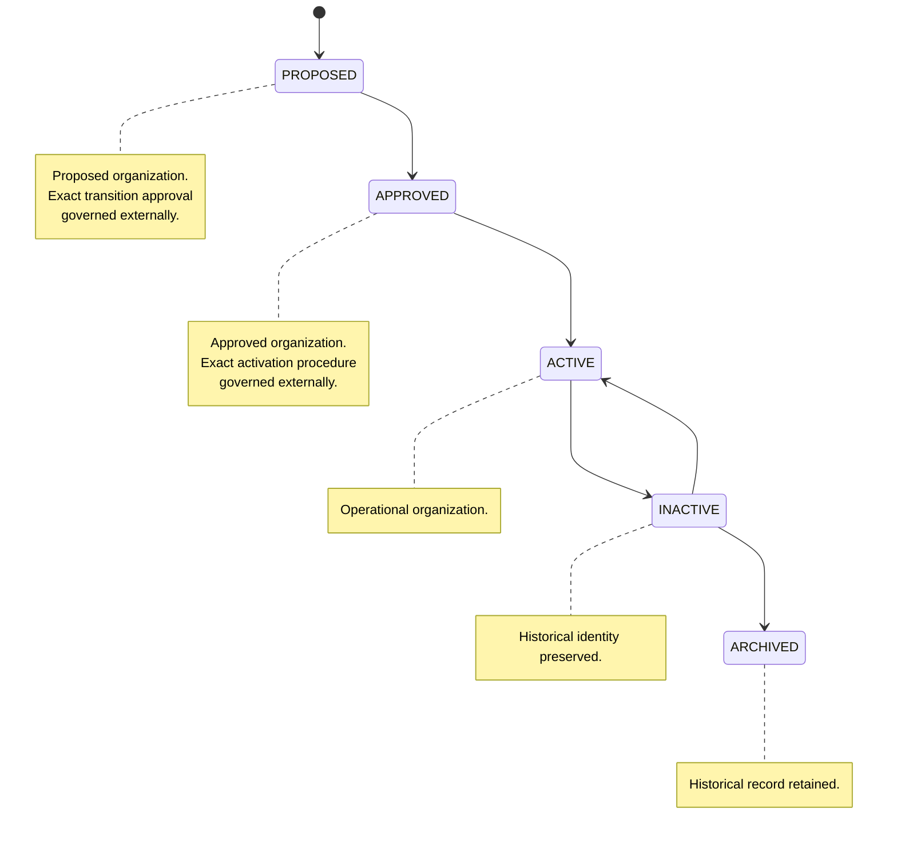

# NSS ERP — Organization Lifecycle

**Document ID:** SOL-ORG-003
**Version:** 1.0.0
**Status:** DRAFT — SOURCE ALIGNED
**Module:** Organization
**Parent System:** Nilachala Saraswata Sangha ERP

---

# 1. Purpose

This document defines the lifecycle of organizational units represented
within the NSS ERP.

The lifecycle governs:

- Organizational creation
- Organizational approval
- Organizational activation
- Organizational inactivity
- Organizational archival
- Organizational identity preservation
- Parent-child relationship integrity
- Historical preservation

The lifecycle is derived from GOV-002 — Organizational Governance Standard.

---

# 2. Governing Authority

The Organization lifecycle is governed by:

- NSS Bye-Law
- Approved authoritative references
- GOV-002 — Organizational Governance Standard
- GOV-005 — Governance Change Control Standard
- Applicable Governance Decision Register decisions

The NSS Bye-Law remains the supreme authority for organizational
structure.

Where a conflict exists, the authoritative statutory source prevails.

---

# 3. Lifecycle Philosophy

An organization is a permanent organizational identity whose operational
state may change over time.

Therefore:

```text
Organization Identity
        ≠
Organization Status
```

Changing the status of an organization does not create a new organizational
identity.

---

# 4. Organizational Identity Across Lifecycle

Once an organization receives its permanent identifier:

* The identifier remains stable.
* The identifier is never reused.
* Status changes do not generate a new organization.
* Historical relationships remain traceable.
* Other ERP modules continue to reference the same organizational identity.

GOV-002 explicitly requires organizational identifiers to remain unique,
stable, and never reused.

---

# 5. Current Lifecycle States

GOV-002 identifies the following typical organizational lifecycle states:

```text
PROPOSED
APPROVED
ACTIVE
INACTIVE
ARCHIVED
```

These states represent the current approved lifecycle vocabulary.

The source does not provide a complete mandatory transition matrix.

---

# 6. Lifecycle Overview

The conceptual lifecycle is:

```text
PROPOSED
    ↓
APPROVED
    ↓
ACTIVE
    ↓
INACTIVE
    ↓
ARCHIVED
```

This diagram represents the general lifecycle described by GOV-002.

It shall not be interpreted as authorization for every possible transition
between every pair of states.

Actual transitions require approved governance procedures.

---

# 7. PROPOSED

`PROPOSED` represents an organizational unit that has been proposed but has
not yet received the required organizational approval.

A proposed organization is not yet an active organizational authority.

---

# 8. Proposed Organization Identity

Where the solution records a proposed organization, its identity shall
remain distinguishable from approved organizational entities.

The proposal shall not be treated as an active statutory organization
before the required approval.

---

# 9. Proposed Organization Hierarchy

A proposed organization shall not be allowed to establish an operational
organizational hierarchy that contradicts the statutory structure.

Its intended parent must be consistent with the applicable authoritative
organizational model.

---

# 10. Proposed Organization Authority

A proposed organization shall not exercise operational or statutory
authority merely because a record exists in the ERP.

Authority begins only after the applicable approval.

---

# 11. PROPOSED → APPROVED

The transition from:

```text
PROPOSED
      ↓
APPROVED
```

requires the applicable approved organizational governance process.

The ERP shall not treat creation of a database record as organizational
approval.

---

# 12. APPROVED

`APPROVED` represents an organizational unit that has received the required
organizational approval but is not necessarily operationally active yet.

The distinction between approval and active operation shall be preserved.

---

# 13. Approved Organization Identity

Once approved, the organization's permanent identity remains stable.

Approval does not create a replacement organization.

---

# 14. Approved Organization Hierarchy

The approved organization's parent-child relationship shall comply with the
statutory organizational hierarchy.

The organization must ultimately trace to the single apex organization.

---

# 15. APPROVED → ACTIVE

Activation shall occur only through the applicable approved organizational
procedure.

The exact activation authority is not specified in GOV-002 and therefore is
not hard-coded in this lifecycle document.

---

# 16. ACTIVE

`ACTIVE` represents an organizational unit that is currently operational
within the approved organizational hierarchy.

An active organization may participate in operational ERP processes subject
to the permissions and rules of the relevant modules.

---

# 17. Active Organization Authority

An active organization may exercise only the authority granted through the
statutory and governance framework.

Being `ACTIVE` does not grant authority beyond the organization's
statutorily defined scope.

---

# 18. Active Organization Hierarchy

An active organization must:

* Have a valid parent unless it is the apex.
* Remain within the statutory hierarchy.
* Maintain valid organizational identity.
* Remain traceable to the apex.

---

# 19. Active Organization and Other Modules

Other ERP modules may use an active organization as organizational context.

Examples include:

```text
Membership
Attendance
Governance
Sevak
Mahila
Kumari
Kishori
Kishor
Reports
Administration
```

Those modules do not own the organization lifecycle.

---

# 20. ACTIVE → INACTIVE

An organization may become `INACTIVE` through an approved organizational
governance procedure.

The exact reason categories and approval workflow are not defined by
GOV-002 and therefore are not invented here.

---

# 21. INACTIVE

`INACTIVE` represents an organization that is no longer currently active
but whose organizational identity and historical information remain
preserved.

Inactive does not mean deleted.

---

# 22. Inactive Organization Identity

An inactive organization retains:

```text
organization_id
organization_pk
organization_name
historical relationships
organizational lineage
```

as applicable.

Its permanent identifier is not reused.

---

# 23. Inactive Organization History

The ERP shall preserve the historical existence of an inactive organization.

Historical records associated with the organization must remain traceable
according to the common audit/history framework.

---

# 24. Inactive Organization and Operational Modules

An inactive organization should not automatically be interpreted as an
active operational scope.

However, the consequences of organizational inactivity for individual
modules are determined by those modules' own business rules.

The Organization Module does not invent those downstream rules.

---

# 25. INACTIVE → ACTIVE

The source establishes `ACTIVE` and `INACTIVE` as lifecycle states but does
not provide a detailed reactivation transition rule.

Therefore:

```text
INACTIVE → ACTIVE
```

requires an approved organizational governance process.

The specific authority and conditions must be defined by the applicable
governance decision.

---

# 26. ARCHIVED

`ARCHIVED` represents an organizational record retained for historical
purposes after its operational lifecycle has ended.

Archival does not mean deletion.

---

# 27. Archive Preservation

An archived organization shall retain its permanent organizational identity.

Its identifier shall never be reassigned.

---

# 28. Archived Organization History

Historical information associated with an archived organization shall remain
traceable.

The ERP shall preserve sufficient history to understand:

```text
Organization
    ↓
Parent
    ↓
Historical Status
    ↓
Organizational Context
```

---

# 29. INACTIVE → ARCHIVED

Archival shall occur only through an approved organizational governance
procedure.

The exact archival timing or mandatory waiting period is not defined by
GOV-002 and therefore is not prescribed here.

---

# 30. APPROVED → INACTIVE

GOV-002 does not define a complete transition matrix.

Therefore, although `INACTIVE` is an approved lifecycle state, this document
does not declare every possible incoming transition as universally valid.

Each transition must comply with approved governance procedure.

---

# 31. ACTIVE → ARCHIVED

The source does not define whether direct:

```text
ACTIVE → ARCHIVED
```

is permitted.

Therefore no direct transition is frozen here.

If required, it must be established through approved governance.

---

# 32. PROPOSED → INACTIVE

No direct transition is defined by the source.

The system shall not invent one.

---

# 33. PROPOSED → ARCHIVED

No direct transition is defined by the source.

The system shall not invent one.

---

# 34. APPROVED → ARCHIVED

No direct transition is defined by the source.

The system shall not invent one.

---

# 35. Lifecycle Transition Principle

The governing rule is:

```text
Lifecycle transitions
        ↓
Approved governance procedure
        ↓
Auditable organizational change
```

GOV-002 explicitly states that lifecycle transitions shall occur only
through approved governance procedures.

---

# 36. No Automatic Lifecycle Transition

The Organization Module shall not automatically change an organization's
status based on:

* Date
* Lack of activity
* Membership count
* Attendance count
* User inactivity
* Reporting conditions

unless an approved governance rule explicitly establishes such automation.

---

# 37. No Activity-Based Inactivation

The Organization Module shall not infer:

```text
No Activity
     ↓
INACTIVE
```

automatically.

Organizational status is a governance decision.

---

# 38. No Membership-Based Inactivation

An organization shall not automatically become inactive merely because:

```text
Members = 0
```

or because its membership falls below a particular number.

No such rule is defined in GOV-002.

---

# 39. No Attendance-Based Inactivation

Attendance activity shall not automatically determine organizational
lifecycle status.

Attendance belongs to the Attendance Module.

---

# 40. Parent Relationship During Lifecycle

The parent-child relationship is a statutory organizational relationship.

Lifecycle changes shall not be used to bypass parent-child integrity.

Every non-apex organization must have exactly one valid parent.

---

# 41. Parent Change

A parent organization change is a governance change.

It shall not be performed merely as a normal administrative edit.

The applicable governance process must authorize the change.

---

# 42. Parent Change and Identity

Changing an organization's parent does not automatically create a new
organization.

The permanent organization identity remains unchanged unless an approved
governance decision establishes a genuinely new organizational entity.

---

# 43. Parent Change History

Where a parent relationship changes through an approved governance action,
the previous relationship must remain historically traceable according to
the project audit/history standards.

---

# 44. Hierarchy Integrity During Lifecycle

At every valid lifecycle state, the organization hierarchy shall avoid:

```text
Multiple Parents
Circular Relationships
Orphan Organizations
Parallel Unauthorized Roots
```

---

# 45. Apex Lifecycle

The apex organization is statutorily special.

There shall be exactly one apex organization in production.

The apex has no parent.

---

# 46. Apex Status

The source establishes the apex as the root of the organizational hierarchy,
but does not define a separate apex-specific status lifecycle.

Therefore no additional apex statuses are introduced here.

---

# 47. Apex Deletion

The apex organization shall not be treated as an ordinary organizational
record that can simply be deleted.

Any change affecting the statutory apex requires authoritative
statutory/governance action.

---

# 48. Organization Name Changes

An approved change to an organization's name does not automatically create a
new organizational identity.

The permanent organization identifier remains stable where the underlying
organization remains the same.

---

# 49. Organization Type Changes

Organization type represents organizational classification.

The source does not define a universal type-change transition.

Therefore any type change must follow the applicable organizational
governance process.

---

# 50. Organization Status Master

The lifecycle uses:

```text
organization_status_master
```

as the controlled status vocabulary.

The master shall not be bypassed through arbitrary free-text statuses.

---

# 51. Status History

Current status and historical status are conceptually different.

```text
Current Status
      +
Historical Status Changes
```

The current status is represented through the Organization model.

Historical status changes are preserved through the common audit/history
framework.

---

# 52. Lifecycle Audit

The following lifecycle actions shall be auditable:

```text
Organization Creation
Organization Approval
Organization Activation
Organization Inactivation
Organization Archival
Parent Change
Organization Type Change
Organization Status Change
```

where the corresponding action is permitted.

---

# 53. Governance Approval

Organizational lifecycle changes shall be traceable to the applicable
governance decision or approval process where required.

The exact approval workflow belongs to the Governance/Administration
framework and is not redefined here.

---

# 54. Delegated Administrative Authority

Administrative delegation may allow authorized users to perform approved
organizational operations.

Delegation shall not:

* Change statutory ownership
* Create unauthorized hierarchy
* Bypass approval requirements
* Alter permanent identity

GOV-002 explicitly states that delegated authority shall not modify
statutory reporting relationships or organizational ownership.

---

# 55. Organizational Independence

An organization cannot become statutorily independent merely because
its ERP status changes.

For example:

```text
ACTIVE
   ↓
INACTIVE
```

does not remove the organization's statutory lineage.

---

# 56. Historical Preservation

The lifecycle shall preserve historical organizational information.

The ERP must be able to determine, where supported by historical data:

```text
What organization existed?
Under which parent?
With which identity?
During which lifecycle period?
```

---

# 57. No Physical Deletion Lifecycle

`ARCHIVED` is not equivalent to physical deletion.

The Organization lifecycle ends in historical preservation, not destruction of
organizational identity.

---

# 58. Identifier Reuse Prohibited

An organization identifier associated with a retired or archived organization
shall never be assigned to another organization.

---

# 59. Cross-Module Lifecycle Impact

When an organization changes lifecycle state, affected modules may need to
apply their own rules.

Examples:

```text
Membership
Attendance
Governance
Sevak
Mahila
Kumari
Kishori
Kishor
Reports
```

Those rules are not automatically defined by the Organization lifecycle.

---

# 60. Membership Impact Boundary

Organization lifecycle does not automatically terminate or change a person's
membership.

Membership rules determine the impact of organizational changes on
membership.

---

# 61. Attendance Impact Boundary

Organization lifecycle does not automatically rewrite historical attendance.

Attendance rules determine how organizational status affects future
attendance operations.

---

# 62. Governance Impact Boundary

Organization lifecycle does not automatically terminate governance
assignments.

Governance rules determine how organizational changes affect office-bearer
assignments.

---

# 63. Specialized Module Impact Boundary

Sevak, Mahila, Kumari, Kishori, and Kishor modules may have their own
organizational consequences.

Those consequences must be documented in their respective business-rule
documents.

---

# 64. Lifecycle and Address

Changing organizational status does not inherently delete or replace the
organization's address.

Address changes are separate organizational data changes.

---

# 65. Lifecycle and Organization Type

Lifecycle status and organization type remain independent concepts.

```text
Organization Type
        ≠
Lifecycle Status
```

---

# 66. Lifecycle and Organization Name

Lifecycle status does not determine the organization name.

Name changes require their own authorized organizational change.

---

# 67. Lifecycle and Organizational Identity

Lifecycle status never replaces the permanent organization identity.

```text
Organization ID
        ↓
Permanent

Organization Status
        ↓
Changeable
```

---

# 68. Proposed Organization — Summary

```text
PROPOSED

Meaning:
Organizational unit proposed for establishment.

Authority:
Not yet operationally established.

Identity:
Must remain distinguishable from active approved entities.

Transition:
Requires approved governance process.
```

---

# 69. Approved Organization — Summary

```text
APPROVED

Meaning:
Organizational unit has received required approval.

Authority:
Approved organizational existence.

Transition:
May proceed to operational activation through approved process.
```

---

# 70. Active Organization — Summary

```text
ACTIVE

Meaning:
Currently operational organizational unit.

Authority:
Exercises only statutorily granted authority.

History:
Identity remains permanent.
```

---

# 71. Inactive Organization — Summary

```text
INACTIVE

Meaning:
No longer currently active.

Identity:
Preserved.

History:
Preserved.

Deletion:
Not permitted merely because organization is inactive.
```

---

# 72. Archived Organization — Summary

```text
ARCHIVED

Meaning:
Historical organizational record retained after operational lifecycle.

Identity:
Permanent.

History:
Preserved.

Reuse:
Identifier cannot be reused.
```

---

# 73. Lifecycle State Model



The diagram shows the principal lifecycle and the explicitly meaningful
reactivation concept; it is not a complete normative transition matrix.

---

# 74. Transition Governance

Every lifecycle transition must satisfy:

```text
Authoritative Basis
        ↓
Approved Governance Procedure
        ↓
Authorized Action
        ↓
Audit Record
        ↓
Updated Organization Status
```

---

# 75. Transition Validation

Before applying a lifecycle transition, the system should validate:

```text
Valid Organization
Valid Current Status
Valid Target Status
Valid Organizational Hierarchy
Required Authorization
Required Governance Approval
Audit Information
```

---

# 76. Invalid Lifecycle Change

The system shall reject an organizational lifecycle change when:

* The acting authority is unauthorized.
* The transition is not approved.
* The organization does not exist.
* The organization violates hierarchy integrity.
* The change creates an invalid organizational root.
* The change would create an orphan or circular relationship.

---

# 77. Lifecycle and Single Root

No lifecycle operation may create a second apex organization.

The production hierarchy must continue to have one and only one root.

---

# 78. Lifecycle and Parent Integrity

No lifecycle operation may leave a non-apex organization without a valid
parent.

---

# 79. Lifecycle and Circularity

No lifecycle operation may create a circular parent relationship.

---

# 80. Lifecycle and Historical Traceability

A lifecycle transition shall not overwrite the organizational history needed
to understand previous states or relationships.

---

# 81. No Unsupported State

The Organization Module shall use only the approved lifecycle vocabulary.

This document does not introduce additional states such as:

```text
SUSPENDED
CLOSED
DISSOLVED
PENDING_REVIEW
REJECTED
```

because these are not established by the current GOV-002 lifecycle rule.

If such states become necessary, they require an approved governance change.

---

# 82. No Automatic State Derivation

The system shall not derive organization status from unrelated operational
data.

For example:

```text
No Members
     ≠
Automatically INACTIVE

No Attendance
     ≠
Automatically INACTIVE

No Recent Activity
     ≠
Automatically ARCHIVED
```

---

# 83. Lifecycle and Reporting

Reports shall distinguish between:

```text
Current Active Organizations
Historical Inactive Organizations
Archived Organizations
```

where status is relevant.

Historical reporting must not silently exclude inactive/archived organizations
when historical analysis is requested.

---

# 84. Lifecycle and Search

Organization search should support filtering by current lifecycle status.

Historical searches should be capable of including inactive and archived
organizations where authorized.

---

# 85. Lifecycle and Dashboards

Operational dashboards may default to active organizations.

Historical dashboards may include inactive and archived organizations.

The dashboard behavior belongs to Reports/Administration and shall not
change the underlying lifecycle.

---

# 86. Lifecycle and Audit

The lifecycle must maintain an auditable history of status changes.

At minimum, the system should be able to determine:

```text
Previous Status
New Status
Change Time
Authorized Actor
Applicable Approval / Reference
```

where those fields are supported by the common audit framework.

---

# 87. Lifecycle Documentation Boundary

This document defines the Organization lifecycle.

It does not define:

* Statutory organizational levels
* Detailed governance election procedures
* RBAC permission matrix
* Membership lifecycle
* Attendance lifecycle
* Specialized module lifecycles
* PostgreSQL implementation

Those belong to their respective authoritative or solution documents.

---

# 88. Source Boundary

The following lifecycle facts are directly supported by GOV-002:

```text
Single apex organization
Exactly one parent for non-apex organizations
Permanent organization identity
Controlled organizational lifecycle
Proposed
Approved
Active
Inactive
Archived
Governance-controlled transitions
```

The source does not provide a complete state-transition matrix.

Therefore this document does not claim one.

---

# 89. Final Lifecycle Principles

```text
✓ One apex organization

✓ Apex has no parent

✓ Every non-apex organization has exactly one parent

✓ Organizational identity is permanent

✓ Organization identifiers are never reused

✓ Organizational lifecycle is controlled

✓ PROPOSED is an approved lifecycle state

✓ APPROVED is an approved lifecycle state

✓ ACTIVE is an approved lifecycle state

✓ INACTIVE is an approved lifecycle state

✓ ARCHIVED is an approved lifecycle state

✓ Lifecycle transitions require approved governance procedures

✓ Historical organizational identity is preserved

✓ Inactive does not mean deleted

✓ Archived does not mean deleted

✓ Parent changes require governance control

✓ No circular hierarchy

✓ No orphan organizations

✓ No second organizational root

✓ No automatic activity-based inactivation

✓ No unsupported lifecycle states

✓ Downstream modules own their own consequences
```

---

# 90. Status

```text
DOCUMENT STATUS:
DRAFT — SOURCE ALIGNED

VERSION:
1.0.0
```

---

# End of Document
