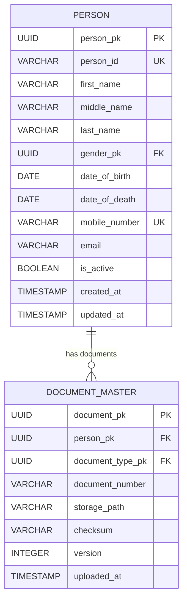
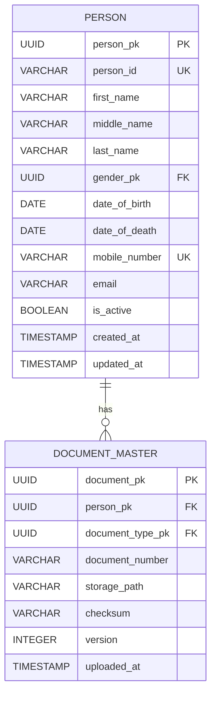
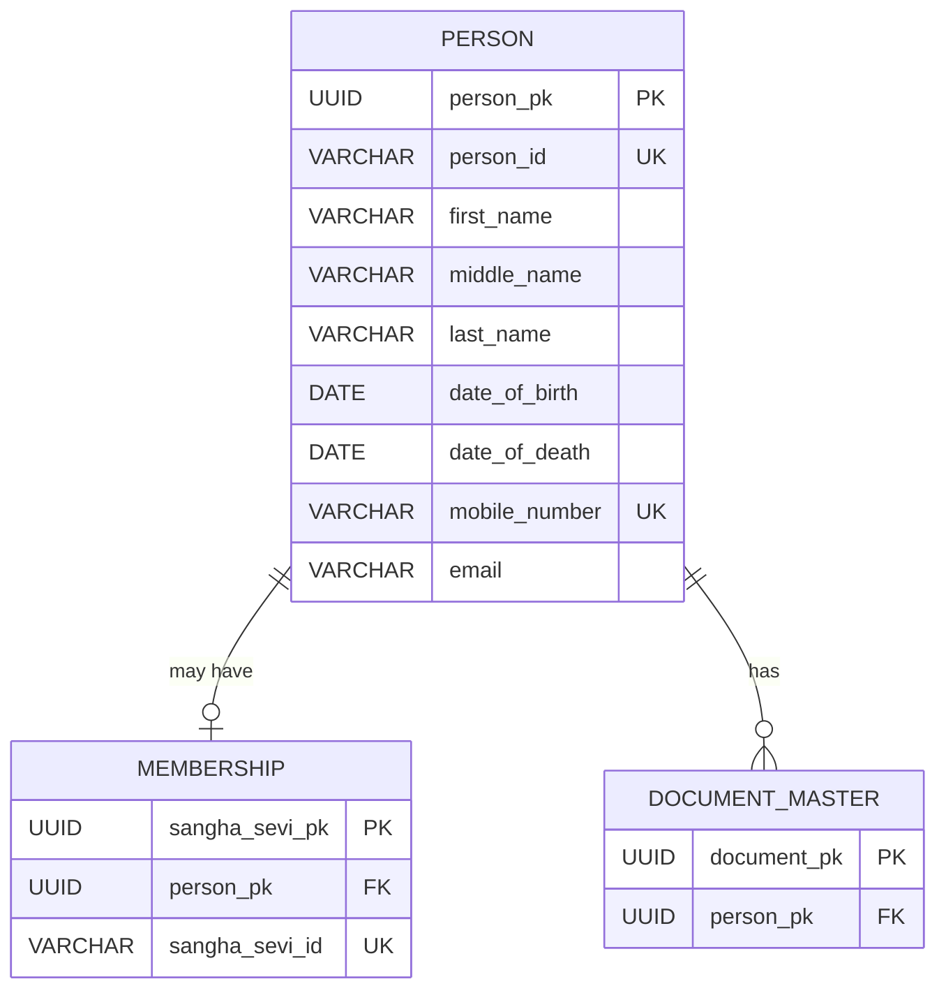

# NSS ERP — Person ERD

**Document ID:** SOL-PER-002
**Version:** 1.0.0
**Status:** DRAFT — SOURCE ALIGNED
**Module:** Person
**Parent System:** Nilachala Saraswata Sangha ERP

---

# 1. Purpose

This document defines the logical Entity Relationship Diagram (ERD) for
the NSS ERP Person Module.

The ERD establishes:

- Person identity
- Person business identifier
- Person core information
- Person document association
- Person-to-membership boundary
- Person-to-family boundary
- Person-to-domain-module boundary

The ERD does not define physical PostgreSQL DDL.

---

# 2. Core Person Principle

The central identity model is:

    PERSON
       |
       +---- Membership
       |
       +---- Family
       |
       +---- Governance
       |
       +---- Attendance
       |
       +---- Mahila
       |
       +---- Kumari
       |
       +---- Kishori
       |
       +---- Kishor
       |
       +---- Sevak

The Person entity is the common individual identity.

---

# 3. Person Is Not Membership

The ERD deliberately separates:

    PERSON

from:

    MEMBERSHIP

Therefore:

    Person
       1
       |
       | 0..1 membership
       |
       ▼
    Membership

A Person may exist without a Membership record.

---

# 4. Current Person Module Tables

The current source identifies two core Person Module tables:

```text
person
document_master
```

These are the current Person Module tables identified in the project schema
baseline.

---

# 5. High-Level ERD



The exact final document columns will be confirmed during Table Design.

---

# 6. Person Entity

The `person` entity represents one individual known to the ERP.

It is the authoritative identity record for that individual.

---

# 7. Person Primary Key

```text
person.person_pk
```

is the internal UUID primary key.

The project standard uses UUID for internal primary keys.

---

# 8. Person Business Identifier

```text
person.person_id
```

is the human-readable business identifier.

Example:

```text
P00000001
P00000002
P00000003
```

The project source establishes centralized ID sequence generation for such
business IDs.

---

# 9. Person Identity Relationship

The identity model is:

```text
person_pk
    +
person_id
```

`person_pk` is the relational identity.

`person_id` is the business-facing identity.

---

# 10. Person Name

The Person entity contains:

```text
first_name
middle_name
last_name
```

These are descriptive attributes and do not define Person identity.

---

# 11. Gender Relationship

Where gender is represented through common master data:

```text
PERSON
   N
   |
   |
   1
GENDER MASTER
```

The Person Module does not own the global gender master.

The exact master implementation belongs to Foundation.

---

# 12. Date of Birth

The Person entity may contain:

```text
date_of_birth
```

Date of birth belongs to the individual identity.

Membership-specific mandatory-DOB rules belong to Membership.

---

# 13. Date of Death

The Person entity may contain:

```text
date_of_death
```

Death is a Person-level historical event.

The Person record remains historically identifiable after death.

---

# 14. Contact Relationship

The Person entity contains:

```text
mobile_number
email
```

The current business rules require at least one contact method.

---

# 15. Mobile Uniqueness

The logical ERD treats:

```text
mobile_number
```

as unique when supplied.

NULL is permitted.

---

# 16. Email Non-Uniqueness

The logical ERD does not impose global uniqueness on:

```text
email
```

Multiple Persons may legitimately share an email address.

---

# 17. Contact Requirement

The Person entity must satisfy:

```text
mobile_number IS NOT NULL
OR
email IS NOT NULL
```

The exact PostgreSQL CHECK constraint belongs to physical schema design.

---

# 18. Document Relationship

A Person may have zero or many associated documents.

Relationship:

```text
PERSON
   1
   |
   | 0..N
   |
   ▼
DOCUMENT_MASTER
```

---

# 19. Document Ownership

`document_master` stores document metadata associated with a Person.

The Person remains the identity owner.

A document does not create a new Person.

---

# 20. Document Type

Documents may reference controlled document types from the common master
framework.

Conceptually:

```text
DOCUMENT_TYPE_MASTER
       1
       |
       N
DOCUMENT_MASTER
       N
       |
       1
     PERSON
```

The exact document-type implementation is finalized outside this ERD where
appropriate.

---

# 21. Document Version

A document may have version information.

The document version belongs to document management, not Person identity.

---

# 22. Document Storage

The ERD represents document metadata/storage references.

It does not prescribe physical binary storage.

Storage may be handled through the project's document-storage architecture.

---

# 23. Document Checksum

Where supported, document metadata may contain a checksum to support:

* Integrity
* Duplicate detection
* File verification

This does not change Person identity.

---

# 24. Person-to-Membership Relationship

The Person-to-Membership relationship is conceptually:

```text
PERSON
  1
  |
  | 0..1
  |
  ▼
MEMBERSHIP
```

A Person may have no membership.

Where the current business model permits only one membership identity per
Person, the membership domain enforces that relationship.

---

# 25. Membership Ownership Boundary

Membership owns:

* Membership identity
* Sangha Sevi ID
* Membership type
* Membership status
* Renewal
* Transfer
* Membership lifecycle

Person owns:

* Individual identity

---

# 26. Sangha Sevi ID Boundary

The ERD does not place:

```text
sangha_sevi_id
```

inside the Person entity.

It belongs to Membership.

Therefore:

```text
person_id
    ≠
sangha_sevi_id
```

---

# 27. Person-to-Family Relationship

The Person entity is referenced by Family.

Conceptually:

```text
PERSON
  1
  |
  | 0..N family relationships
  |
  ▼
FAMILY RELATIONSHIP
```

The Family Module owns the family relationship model.

---

# 28. Non-Member Family Person

A Person may participate in a family without membership.

Example:

```text
Family
│
├── NSS Member
├── Spouse — Non-member
├── Child — Non-member
└── Parent — Non-member
```

All individuals may have Person records.

---

# 29. Person-to-Organization Boundary

Person and Organization are separate entities:

```text
PERSON
    ≠
ORGANIZATION
```

A Person may be associated with an Organization through other domain
relationships.

The Person Module does not store the Organization hierarchy.

---

# 30. Person-to-Governance Relationship

Governance may associate a Person with:

* Governing bodies
* Positions
* Office-bearer assignments
* Terms

Conceptually:

```text
PERSON
   1
   |
   | 0..N
   |
   ▼
GOVERNANCE ASSIGNMENT
```

Governance owns these relationships.

---

# 31. Person-to-Attendance Relationship

Attendance may reference:

```text
person_pk
```

where applicable.

Conceptually:

```text
PERSON
   1
   |
   | 0..N
   |
   ▼
ATTENDANCE
```

Attendance owns attendance records and rules.

---

# 32. Person-to-Mahila Relationship

Mahila-specific records may reference:

```text
person_pk
```

The Mahila Module does not create a duplicate Person entity.

---

# 33. Person-to-Kumari Relationship

Kumari-specific participation may reference:

```text
person_pk
```

The Kumari Module does not create a duplicate Person entity.

---

# 34. Person-to-Kishori Relationship

Kishori-specific records may reference:

```text
person_pk
```

The Kishori Module does not create a duplicate Person identity.

---

# 35. Person-to-Kishor Relationship

Kishor-specific records may reference:

```text
person_pk
```

The Kishor Module does not create a duplicate Person identity.

---

# 36. Person-to-Sevak Relationship

Sevak participation may reference Person and Membership identities as
required by the Sevak business rules.

The Sevak Module does not create a duplicate Person master.

---

# 37. Person-to-Authentication Boundary

Authentication may associate an account with the appropriate Person/Membership
identity.

Conceptually:

```text
PERSON
   |
   └── Authentication Account
```

A Person does not automatically receive an account.

Authentication owns login credentials and permissions.

---

# 38. Person-to-Document Relationship

The document relationship is:

```text
PERSON
  1
  |
  | 0..N
  ▼
DOCUMENT_MASTER
```

A document may represent identity/supporting documentation associated with
the Person.

---

# 39. Document and Person Identity

Deleting or replacing a document must not create or delete a Person identity.

Document lifecycle and Person lifecycle are separate.

---

# 40. Person Lifecycle Boundary

The Person lifecycle is independent of:

```text
Membership lifecycle
Organization lifecycle
Attendance lifecycle
Sevak participation lifecycle
Mahila participation lifecycle
Kumari lifecycle
Kishor/Kishori lifecycle
```

---

# 41. Person Status

Where a Person operational status is maintained, it belongs to the Person
entity.

It must not be confused with Membership or Organization status.

---

# 42. Historical Person

A historical Person remains identifiable even after:

* Death
* Membership cessation
* Organizational changes
* Participation cessation

The Person identity is not recreated for historical reporting.

---

# 43. Person ID Reuse

A Person ID is permanent.

It shall never be reassigned to another Person.

---

# 44. Person Duplicate Prevention

The system should identify probable duplicate Person records.

Duplicate detection may use:

```text
Mobile
Name
Date of Birth
Email
Family Context
Other approved identity attributes
```

The ERD does not define an automatic merge relationship.

---

# 45. Person Merge Boundary

A merge operation, if eventually supported, must preserve all domain
relationships before consolidating identity.

It is an identity-management operation, not a normal CRUD operation.

---

# 46. Person Address Boundary

Person address information is part of the Person domain.

The exact address entity/table relationship is intentionally left for the
Person Table Design because the current source does not justify inventing
the final address structure here.

---

# 47. Person Identity Diagram

```text
                    PERSON
                      │
          ┌───────────┼───────────┐
          │           │           │
          ▼           ▼           ▼
       Family     Membership   Documents
          │
          │
          ├── Governance
          ├── Attendance
          ├── Mahila
          ├── Kumari
          ├── Kishori
          ├── Kishor
          └── Sevak
```

---

# 48. Current Person Core ERD



---

# 49. Person + Membership Context



`MEMBERSHIP` is shown here only as a domain relationship. It is not a
Person Module table.

---

# 50. Person + Family Context

```text
                    PERSON
                       │
            ┌──────────┴──────────┐
            │                     │
            ▼                     ▼
     Family Member A       Family Member B
            │                     │
            └──── Family Group ───┘
```

The Family Module owns the relationship.

---

# 51. Person + Domain Modules

```text
                         PERSON
                           │
          ┌────────────────┼────────────────┐
          │                │                │
          ▼                ▼                ▼
      MEMBERSHIP         FAMILY         GOVERNANCE
          │                │                │
          ▼                ▼                ▼
      SANGHA SEVI    FAMILY RELATION    ASSIGNMENT
          
          │
          ├──────────── ATTENDANCE
          │
          ├──────────── MAHILA
          │
          ├──────────── KUMARI
          │
          ├──────────── KISHORI
          │
          ├──────────── KISHOR
          │
          └──────────── SEVAK
```

---

# 52. Referential Ownership

The ownership model is:

| Domain         | Owns                            |
| -------------- | ------------------------------- |
| Person         | Person identity                 |
| Membership     | Membership identity/lifecycle   |
| Family         | Family relationships            |
| Organization   | Organization identity/hierarchy |
| Governance     | Governance assignments          |
| Attendance     | Attendance                      |
| Mahila         | Mahila participation            |
| Kumari         | Kumari participation            |
| Kishori        | Kishori participation           |
| Kishor        | Kishor participation           |
| Sevak          | Sevak participation             |
| Authentication | User accounts/authentication    |

---

# 53. Person Identity Reuse

The same `person_pk` shall be used wherever another module needs to
reference the same individual.

The system shall not create:

```text
Mahila Person
Kumari Person
Sevak Person
Membership Person
```

as separate identities for the same individual.

---

# 54. Foreign-Key Principle

Cross-module relationships should reference:

```text
person_pk
```

rather than:

```text
person_id
```

The project database standard explicitly requires foreign keys to reference
internal primary keys rather than business IDs.

---

# 55. Business Identifier Principle

Human-readable:

```text
person_id
```

is intended for:

* UI
* Search
* Reports
* Printed documents
* Human communication

Internal relationships use:

```text
person_pk
```

---

# 56. Audit Relationship

The common audit framework may reference the acting user/member identity.

The Person ERD does not create a separate audit entity.

Audit implementation belongs to the common Foundation/Audit architecture.

---

# 57. Soft Delete Boundary

The Person entity is not normally physically deleted.

Where a record-management state is required, the common project soft-delete
standard applies.

---

# 58. Security Boundary

Sensitive Person information shall be protected through the common security
and authorization framework.

The ERD does not define a separate Person security model.

---

# 59. Document Security

Documents associated with Persons may contain sensitive information.

Document access must follow the common authorization/security model.

---

# 60. No Duplicate Person Through Membership

When an existing non-member Person becomes an NSS member:

```text
Existing Person
      ↓
Membership Approved
      ↓
Membership Created
      ↓
Same person_pk
```

A new Person record shall not be created.

---

# 61. No Duplicate Person Through Marriage

When a non-member spouse is later registered as an NSS member:

```text
Existing Person
      ↓
Membership
      ↓
Same person_pk
```

No duplicate Person identity is created.

---

# 62. No Duplicate Person Through Youth Transition

A youth participant who later becomes an NSS member continues to use the same
Person identity.

Membership is added to the existing Person.

---

# 63. No Duplicate Person Through Organizational Transfer

A Person transferring between organizational units does not receive a new
Person identity.

Organizational association is a separate relationship.

---

# 64. No Duplicate Person Through Name Correction

Correcting a person's name does not create another Person.

---

# 65. No Duplicate Person Through Address Change

Changing a person's address does not create another Person.

---

# 66. Person Identity Invariant

The following invariant shall always hold:

```text
One Individual
      ↓
One Person Identity
      ↓
person_pk
      +
person_id
```

Domain participation is layered on top of this identity.

---

# 67. ERD Boundary

This document defines the logical Person identity relationships.

It does not finalize:

* Full Person column list
* Full address structure
* Full document metadata structure
* Physical sensitive-data storage
* PostgreSQL constraints
* PostgreSQL indexes
* Django model implementation
* API implementation

Those belong to subsequent solution/implementation documents.

---

# 68. Final ERD Principles

```text
✓ Person is the foundational identity

✓ Person ≠ Member

✓ Person may exist without Membership

✓ Person may exist without Login Account

✓ Person may exist without NSS membership

✓ Person has permanent internal identity

✓ Person has permanent business identifier

✓ Person ID is centrally generated

✓ Person ID is never reused

✓ Mobile is unique when supplied

✓ Email is not globally unique

✓ At least one contact method is required

✓ Person may have zero or many documents

✓ Membership references Person

✓ Family references Person

✓ Governance references Person

✓ Attendance may reference Person

✓ Mahila references Person

✓ Kumari references Person

✓ Kishori references Person

✓ Kishor references Person

✓ Sevak references Person

✓ Domain modules do not duplicate Person identity

✓ Cross-module references use person_pk

✓ Historical Person identity is preserved

✓ Document identity is separate from Person identity

✓ Person lifecycle is separate from Membership lifecycle

✓ Person identity is not replaced by demographic changes
```

---

# 69. Current Person ERD Scope

```text
PERSON
   │
   └── DOCUMENT_MASTER

External relationships:

PERSON
   ├── MEMBERSHIP
   ├── FAMILY
   ├── GOVERNANCE
   ├── ATTENDANCE
   ├── MAHILA
   ├── KUMARI
   ├── KISHORI
   ├── KISHOR
   └── SEVAK
```

---

# 70. Status

```text
DOCUMENT STATUS:
DRAFT — SOURCE ALIGNED

VERSION:
1.0.0
```

---

# End of Document
