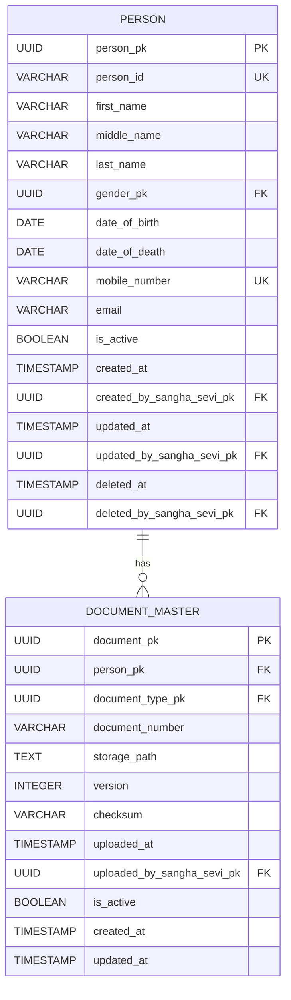

# NSS ERP — Person Table Design

**Document ID:** SOL-PER-004  
**Version:** 1.0.0  
**Status:** DRAFT — SOURCE ALIGNED  
**Module:** Person  
**Parent System:** Nilachala Saraswata Sangha ERP

---

# 1. Purpose

This document defines the logical table design for the NSS ERP Person Module.

It translates the Person:

- Module Design
- ERD
- Business Rules
- Common Database Standards

into a table-level logical design.

This document does not define:

- PostgreSQL DDL
- Django migrations
- Physical indexes
- Database triggers
- API implementation
- UI implementation

---

# 2. Current Person Table Scope

The current Person Module contains:

```text
person
```

`document_master` was originally defined here but has been reassigned to the
Foundation Module as a shared document registry (DOC-ARCH-001).
Person remains a consumer of `document_master` through explicit FK
relationships.

No additional Person table is introduced without an approved design change.

---

# 3. Core Design Principle

The Person table represents:

```text
ONE INDIVIDUAL
        ↓
ONE PERSON IDENTITY
```

Membership, Family, Governance, Attendance, Mahila, Kumari, Kishori,
Kishor, and Sevak records reference Person identity where applicable.

The Person table is not the Membership table.

---

# 4. Database Naming Standards

The Person design follows the project database conventions.

## Internal Primary Key

```text
<table_name>_pk
```

Example:

```text
person_pk
```

## Business Identifier

```text
<table_name>_id
```

Example:

```text
person_id
```

## Foreign Key

Foreign keys reference internal primary keys.

Example:

```text
person_pk
```

rather than:

```text
person_id
```

The project database standard explicitly establishes UUID internal keys and
human-readable business IDs.

---

# 5. Table 1 — `person`

## Purpose

`person` is the authoritative identity table for an individual known to
the NSS ERP.

A Person may or may not have an NSS Membership.

---

# 6. `person` — Logical Columns

| Column                      |    Required | Key    | Description                        |
| --------------------------- | ----------: | ------ | ---------------------------------- |
| `person_pk`                 |         Yes | PK     | Internal Person identity           |
| `person_id`                 |         Yes | UNIQUE | Permanent human-readable Person ID |
| `first_name`                |         Yes | —      | First name                         |
| `middle_name`               |          No | —      | Middle name                        |
| `last_name`                 |          No | —      | Last name                          |
| `gender_pk`                 |          No | FK     | Gender master reference            |
| `date_of_birth`             |          No | —      | Date of birth                      |
| `date_of_death`             |          No | —      | Date of death                      |
| `mobile_number`             | Conditional | UNIQUE | Mobile contact                     |
| `email`                     | Conditional | —      | Email contact                      |
| `is_active`                 |         Yes | —      | Person record operational state    |
| `created_at`                |         Yes | —      | Creation timestamp                 |
| `created_by_sangha_sevi_pk` |          No | FK     | Creating user/member reference     |
| `updated_at`                |         Yes | —      | Last update timestamp              |
| `updated_by_sangha_sevi_pk` |          No | FK     | Updating user/member reference     |
| `deleted_at`                |          No | —      | Soft-delete timestamp              |
| `deleted_by_sangha_sevi_pk` |          No | FK     | Deleting user/member reference     |

The exact physical datatypes remain an implementation concern.

---

# 7. `person_pk`

`person_pk` is the internal primary key.

Requirements:

* UUID
* Unique
* Immutable
* Used for relational references
* Not the normal human-facing identifier

The project database standard explicitly freezes UUIDs for internal primary
keys.

---

# 8. `person_id`

`person_id` is the permanent human-readable Person business identifier.

Illustrative values:

```text
P00000001
P00000002
P00000003
```

The project source establishes centralized ID generation using
`id_sequence_master`.

---

# 9. Person ID Rules

`person_id` shall be:

* Unique
* System-generated
* Permanent
* Stable
* Never reused

It shall not be generated through application-local counters.

---

# 10. `first_name`

Stores the person's first/given name.

This is a Person attribute and does not constitute identity.

---

# 11. `middle_name`

Stores an optional middle name.

A Person may exist without a middle name.

---

# 12. `last_name`

Stores the person's family/last name where applicable.

The project does not require that every Person have a conventional last name.

---

# 13. Name and Identity

Changing:

```text
first_name
middle_name
last_name
```

does not create a new Person.

The permanent identity remains:

```text
person_pk
person_id
```

---

# 14. `gender_pk`

References the common gender master where gender is maintained through
controlled master data.

The Person Module does not own the global gender master.

---

# 15. Gender Boundary

The Person table stores the Person's gender reference.

It does not use gender to determine:

* Membership
* Organization
* Authentication
* Governance position

Those rules belong to their respective domains.

---

# 16. `date_of_birth`

Stores the Person's date of birth where known.

Date of birth is a Person-level demographic attribute.

---

# 17. Date of Birth and Membership

Person creation does not automatically require the Membership-specific
date-of-birth requirements.

Where Membership approval requires DOB, Membership rules govern that
requirement.

---

# 18. `date_of_death`

Stores date of death where known.

It preserves historical identity information.

---

# 19. Date of Death and Deletion

Recording a date of death does not mean:

```text
DELETE PERSON
```

The Person remains historically identifiable.

---

# 20. `mobile_number`

Stores the Person's mobile contact number.

The current Person business rule establishes uniqueness when supplied.

---

# 21. Mobile Number Nullability

`mobile_number` may be NULL if the Person has a valid email address.

---

# 22. Mobile Number Uniqueness

When present:

```text
mobile_number
```

must identify at most one Person.

The exact physical implementation of NULL-aware uniqueness belongs to
PostgreSQL schema design.

---

# 23. `email`

Stores the Person's email address where available.

---

# 24. Email Nullability

Email may be NULL when mobile number is present.

---

# 25. Email Uniqueness

Email is not globally unique.

Multiple Person records may legitimately share an email address.

---

# 26. Contact Requirement

The Person record must satisfy:

```text
mobile_number IS NOT NULL
OR
email IS NOT NULL
```

Therefore:

```text
mobile_number IS NULL
AND
email IS NULL
```

is invalid.

The physical PostgreSQL CHECK constraint will be defined later.

---

# 27. Contact Normalization

The final physical implementation should normalize mobile/email values
according to the project's common data-quality and internationalization
standards.

This document does not prescribe a specific normalization algorithm.

---

# 28. `is_active`

Represents the operational state of the Person record.

It is distinct from:

```text
Membership Status
Organization Status
Authentication Status
```

---

# 29. Person Status Boundary

`is_active` shall not be interpreted as:

```text
NSS Membership Active
```

A Person may remain active as a Person even when Membership is inactive or
has ended.

---

# 30. Audit Columns

The project database standard establishes common audit fields including:

```text
created_at
created_by_sangha_sevi_pk

updated_at
updated_by_sangha_sevi_pk

deleted_at
deleted_by_sangha_sevi_pk
```

and:

```text
is_active
```

for major transactional records.

The Person table follows that standard.

---

# 31. `created_at`

Records when the Person record was created.

---

# 32. `created_by_sangha_sevi_pk`

Identifies the authorized NSS user/member responsible for creating the
record where the common audit framework requires such attribution.

The exact authentication/audit implementation belongs to the common
Foundation/Security architecture.

---

# 33. `updated_at`

Records the latest update timestamp.

---

# 34. `updated_by_sangha_sevi_pk`

Identifies the authorized user/member responsible for the latest update
where the common audit framework requires attribution.

---

# 35. `deleted_at`

Records the timestamp of a soft-delete operation.

---

# 36. `deleted_by_sangha_sevi_pk`

Identifies the authorized user/member responsible for the soft-delete
operation where applicable.

---

# 37. Soft Delete

The project standard prohibits ordinary physical deletion of major
transactional records and uses soft-delete semantics.

For Person:

```text
is_active = FALSE
deleted_at = timestamp
```

may be used according to the common lifecycle/audit framework.

---

# 38. Historical Person Preservation

A Person record should remain available when historical relationships require
it.

Examples:

* Former Member
* Historical office-bearer
* Family history
* Historical attendance
* Historical participation

---

# 39. Person-to-Membership Relationship

The Person table is referenced by Membership.

Conceptually:

```text
person
   1
   │
   │ 0..1
   ▼
sangha_sevi
```

The Membership Module owns the Membership record.

---

# 40. No `sangha_sevi_id` in Person

The Person table shall not contain:

```text
sangha_sevi_id
```

as the Person's identity.

Sangha Sevi ID belongs to Membership.

---

# 41. Person-to-Family Relationship

Family tables reference:

```text
person_pk
```

The Person table does not contain family-group ownership fields unless
explicitly established by the Family design.

---

# 42. Person-to-Organization Relationship

The Person table does not own:

```text
organization_pk
```

as a permanent Person identity attribute.

Organizational association belongs to the appropriate domain relationship.

This prevents a Person from being incorrectly treated as belonging to only
one Organization.

---

# 43. Person-to-Governance Relationship

Governance tables reference Person identity.

The Person table does not contain:

```text
position_pk
governing_body_pk
office_bearer_pk
```

Governance owns those relationships.

---

# 44. Person-to-Attendance Relationship

Attendance records may reference:

```text
person_pk
```

The Person table does not store attendance history.

Attendance owns attendance records.

---

# 45. Specialized Module Relationships

The following modules may reference `person_pk`:

```text
Mahila
Kumari
Kishori
Kishor
Sevak
```

They shall not create duplicate Person master records.

---

# 46. No Specialized Person Identity

The following concepts shall not become separate Person identities:

```text
Mahila Person
Kumari Person
Kishori Person
Kishor Person
Sevak Person
```

They are domain participation records associated with the same Person.

---

# 47. Person Address

The current Person source establishes that address information belongs to
the Person domain, but the exact final address-table structure is not
sufficiently frozen in the available source.

Therefore this document does not invent a final address table.

---

# 48. Address Design Boundary

Current status:

```text
Person Address Concept
    = REQUIRED

Exact Physical Address Structure
    = OPEN
```

The address model must be resolved before physical Person schema generation.

---

# 49. Aadhaar / Sensitive Identity Data

Earlier project schema discussions considered fields such as:

```text
aadhaar_encrypted
aadhaar_hash
aadhaar_last4
```

as potential Person data.

These are **not frozen as columns by this document** because the current
source does not establish their final physical representation.

If implemented, sensitive identity data must follow the project's security
standards.

---

# 50. Photo

Earlier schema planning also considered:

```text
photo_path
```

for Person.

The current design prefers document/storage architecture rather than
embedding binary data into the core identity table.

The exact photo/document relationship remains subject to the Document
Management design.

---

# 51. Emergency Contact

Earlier schema planning mentioned:

```text
emergency_contact
```

This is not frozen as a final Person column by the current source.

It should not be added to the physical schema until its business meaning,
relationship, and ownership are formally defined.

---

# 52. Blood Group

Earlier schema planning mentioned:

```text
blood_group
```

This is not frozen as a final Person column by the current source.

It remains an open design consideration rather than a mandatory Person
column.

---

# 53. Table 2 — `document_master`

## Ownership Reassignment (DOC-ARCH-001)

`document_master` has been reassigned to the Foundation Module as a shared
document registry. The logical design below is preserved for reference, but
Foundation is the authoritative DDL owner.

Person references `document_master` through an explicit FK relationship
(exact pattern — direct FK or junction table — to be determined during
Person DDL design).

## Purpose

Stores document metadata associated with Person identity and the project's
document-management framework.

The document itself is not the Person identity.

---

# 54. `document_master` — Logical Columns

The current source establishes the document concept and metadata such as:

* Document Type
* Storage Path
* Version
* Checksum
* Uploaded By

The following logical design represents those concepts without claiming a
final physical schema:

| Column                       |    Required | Key | Description                     |
| ---------------------------- | ----------: | --- | ------------------------------- |
| `document_pk`                |         Yes | PK  | Internal document identity      |
| `person_pk`                  | Conditional | FK  | Person associated with document |
| `document_type_pk`           |         Yes | FK  | Controlled document type        |
| `document_number`            |          No | —   | Document/reference number       |
| `storage_path`               |         Yes | —   | Storage reference               |
| `version`                    |         Yes | —   | Document version                |
| `checksum`                   |          No | —   | File integrity checksum         |
| `uploaded_at`                |         Yes | —   | Upload timestamp                |
| `uploaded_by_sangha_sevi_pk` |          No | FK  | Uploading user/member           |
| `is_active`                  |         Yes | —   | Current document state          |
| `created_at`                 |         Yes | —   | Creation timestamp              |
| `updated_at`                 |         Yes | —   | Last update timestamp           |

Only the concepts supported by the current source are represented here.

---

# 55. `document_pk`

Internal primary key for the document record.

The project database convention uses UUID internal primary keys.

---

# 56. `person_pk` in `document_master`

Where a document belongs to a Person, `person_pk` identifies the associated
Person.

The document references the Person's internal primary key, not:

```text
person_id
```

---

# 57. Document Type

`document_type_pk` references the common controlled document-type master.

The Person Module does not independently maintain a duplicate document-type
master.

---

# 58. `document_number`

Optional document/reference number where applicable.

Not all documents require an external document number.

---

# 59. `storage_path`

Stores the logical reference to the physical document location.

The Person Module does not prescribe whether storage is:

* Local filesystem
* Object storage
* Another approved document repository

---

# 60. `version`

Represents the document version where document versioning applies.

Document versioning is separate from Person identity.

---

# 61. `checksum`

May store a checksum used to verify document integrity.

The exact algorithm is an implementation decision.

---

# 62. `uploaded_at`

Records when the document was uploaded/registered.

---

# 63. `uploaded_by_sangha_sevi_pk`

Identifies the authorized uploader where the common audit/security framework
requires attribution.

---

# 64. Document Active State

`is_active` identifies whether the document record is currently active.

A superseded document may remain historically preserved.

---

# 65. Document History

Document history shall not automatically delete the Person record.

Replacing a document does not replace Person identity.

---

# 66. Person-to-Document Cardinality

The logical relationship is:

```text
PERSON
   1
   │
   │ 0..N
   ▼
DOCUMENT_MASTER
```

A Person may have no documents or multiple documents.

---

# 67. Document-to-Person Ownership

A Person document is associated with a Person identity.

A document does not create a new Person.

---

# 68. Common Master Dependencies

The Person Module reuses common Foundation masters where applicable:

```text
Gender
Document Type
Country
State/Province
District
City/Village
Pincode
```

The exact common master names shall follow the final Foundation design.

---

# 69. Common ID Sequence Dependency

Person business IDs depend on:

```text
id_sequence_master
```

The Person Module shall not maintain its own sequence mechanism.

---

# 70. Common Audit Dependency

Person and document audit fields follow the common project audit standard.

The Person Module shall not create a separate audit framework.

---

# 71. Security Dependency

Person and document access follows the common:

```text
Authentication
RBAC
Authorization
Audit
```

architecture.

---

# 72. Foreign Key Summary

| Child Table       | Column                       | Parent                      |
| ----------------- | ---------------------------- | --------------------------- |
| `document_master` | `person_pk`                  | `person`                    |
| `person`          | `gender_pk`                  | Common Gender Master        |
| `person`          | `created_by_sangha_sevi_pk`  | Membership/User identity    |
| `person`          | `updated_by_sangha_sevi_pk`  | Membership/User identity    |
| `person`          | `deleted_by_sangha_sevi_pk`  | Membership/User identity    |
| `document_master` | `document_type_pk`           | Common Document Type Master |
| `document_master` | `uploaded_by_sangha_sevi_pk` | Membership/User identity    |

The exact physical foreign-key targets shall follow the final common
Foundation/Security schema.

---

# 73. Logical Relationship Model



---

# 74. Membership Relationship — External

The Person Module does not own the Membership table.

Logical relationship:

```text
PERSON
  1
  │
  │ 0..1
  ▼
MEMBERSHIP
```

Membership is a separate module.

---

# 75. Family Relationship — External

The Person Module does not own Family relationships.

Logical relationship:

```text
PERSON
  1
  │
  │ 0..N
  ▼
FAMILY RELATIONSHIPS
```

Family is a separate module.

---

# 76. Governance Relationship — External

Governance references Person identity.

The Person table does not contain governance assignment fields.

---

# 77. Attendance Relationship — External

Attendance references Person identity where applicable.

The Person table does not contain attendance records.

---

# 78. Specialized Module Relationship — External

Mahila, Kumari, Kishori, Kishor, and Sevak may reference Person identity.

No duplicate Person table is created in those modules.

---

# 79. Identity Integrity Requirements

The logical design requires:

```text
person_pk
    → unique

person_id
    → unique

mobile_number
    → unique when supplied

mobile_number OR email
    → at least one required

document person_pk
    → valid Person reference

document type
    → valid controlled reference
```

---

# 80. Historical Integrity

The Person table must preserve identity across:

```text
Name Change
Address Change
Contact Change
Membership Change
Organization Change
Family Change
Participation Change
```

---

# 81. No Person Duplication

The physical database and application layer should work together to prevent
creation of duplicate Person identities.

Potential duplicate detection is an application/business concern and is not
reduced to a single database constraint.

---

# 82. Person Merge

Person merge is not a simple table operation.

If implemented later, the process must preserve all affected relationships
and historical information.

The merge workflow is outside the current table-design scope.

---

# 83. Person Deletion

Physical deletion is not the normal Person lifecycle.

Historical records shall remain available where required.

---

# 84. Auditability

At minimum, the Person design supports:

```text
Created
Updated
Soft Deleted
```

with responsible-user attribution through the common audit framework.

---

# 85. Security

Sensitive Person information and documents shall be protected by the
common security framework.

The Person table shall not expose sensitive values unnecessarily.

---

# 86. Person Table Summary

```text
person
│
├── person_pk
├── person_id
│
├── first_name
├── middle_name
├── last_name
├── gender_pk
├── date_of_birth
├── date_of_death
│
├── mobile_number
├── email
│
├── is_active
│
├── created_at
├── created_by_sangha_sevi_pk
├── updated_at
├── updated_by_sangha_sevi_pk
├── deleted_at
└── deleted_by_sangha_sevi_pk
```

---

# 87. Document Master Summary

```text
document_master
│
├── document_pk
├── person_pk
├── document_type_pk
├── document_number
├── storage_path
├── version
├── checksum
├── uploaded_at
├── uploaded_by_sangha_sevi_pk
├── is_active
├── created_at
└── updated_at
```

---

# 88. Current Table Count

```text
Person Module
────────────────────────────
person                  1
────────────────────────────
TOTAL                   1
```

`document_master` (previously counted here) is now owned by Foundation
(DOC-ARCH-001).

---

# 89. Explicitly Not Added

The following are not added as frozen Person tables/columns without further
approved design:

```text
person_address
person_address_history
person_merge_history
person_status_master
aadhaar_encrypted
aadhaar_hash
aadhaar_last4
photo_path
blood_group
emergency_contact
```

Earlier project discussions mentioned some of these concepts, but the
current Person solution baseline does not establish their final physical
representation.

---

# 90. Important Design Boundary

This document intentionally distinguishes:

```text
SOURCE-SUPPORTED DESIGN
        from
IMPLEMENTATION ASSUMPTIONS
```

Only source-supported Person structures are treated as frozen.

---

# 91. Physical Schema Boundary

This document does not define:

```text
CREATE TABLE
ALTER TABLE
CHECK CONSTRAINT SQL
INDEX SQL
TRIGGER SQL
PostgreSQL datatype selection beyond established PK conventions
Django models
FastAPI endpoints
UI
```

These belong to the implementation stage.

---

# 92. Person Module Final Logical Model

```text
                    PERSON
                      │
                      │
             ┌────────┴────────┐
             │                 │
             ▼                 ▼
       PERSON IDENTITY     DOCUMENT MASTER
             │
             │
       ┌─────┼─────┬──────────┬──────────┐
       ▼     ▼     ▼          ▼          ▼
   FAMILY  MEMBER  GOV     ATTENDANCE  SPECIALIZED
                               │
                     ┌─────────┼─────────┐
                     ▼         ▼         ▼
                   Mahila    Kumari    Sevak
```

---

# 93. Final Person Table Principles

```text
✓ Person is the core individual identity

✓ Person ≠ Member

✓ Person Module contains 2 current tables

✓ person is the central Person table

✓ document_master stores document metadata

✓ person_pk is the internal UUID identity

✓ person_id is the human-readable business identity

✓ person_id is unique

✓ person_id is permanent

✓ person_id is centrally generated

✓ person_id is never reused

✓ Foreign keys reference person_pk

✓ Mobile is unique when supplied

✓ Email is not globally unique

✓ At least one contact method is required

✓ Person identity survives Membership changes

✓ Person identity survives organizational changes

✓ Person identity survives family changes

✓ Person identity survives demographic corrections

✓ Person records are historically preserved

✓ Person documents reference Person identity

✓ Person does not own Membership

✓ Person does not own Family

✓ Person does not own Organization

✓ Person does not own Governance

✓ Person does not own Attendance

✓ Specialized modules reuse Person identity

✓ Common audit framework is reused

✓ Common security framework is reused

✓ Common master-data framework is reused

✓ No SQL is defined in this document
```

---

# 94. Open Items Before Physical Person Schema

The following must be resolved before PostgreSQL schema generation:

| Item                          | Status         |
| ----------------------------- | -------------- |
| Person address structure      | OPEN           |
| Sensitive identity storage    | OPEN           |
| Photo/document implementation | OPEN           |
| Blood group                   | OPEN           |
| Emergency contact             | OPEN           |
| Person status vocabulary      | OPEN           |
| Person merge history          | OPEN           |
| Exact document versioning     | OPEN           |
| Physical constraints          | IMPLEMENTATION |
| Physical indexes              | IMPLEMENTATION |

These are deliberately not silently frozen.

---

# 95. Status

```text
DOCUMENT STATUS:
DRAFT — SOURCE ALIGNED

VERSION:
1.0.0
```

---

# End of Document
