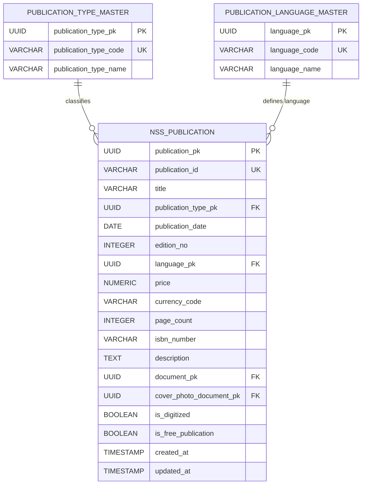

# NSS ERP — Publications ERD

**Document ID:** SOL-PUB-002
**Version:** 1.0.0
**Status:** DRAFT — SOURCE ALIGNED
**Module:** Publications
**Parent System:** Nilachala Saraswata Sangha ERP

---

# 1. Purpose

This document defines the logical Entity Relationship Diagram (ERD) for
the NSS ERP Publications Module.

The ERD represents the existing frozen publication foundation and defines
how the Publications Module relates to:

- Publication identity
- Publication type
- Publication language
- Digital documents
- Cover documents
- Founder & Heritage
- Future operational publication capabilities

This document does not introduce new physical database tables.

---

# 2. Current Publication Foundation

The current frozen publication foundation consists of:

    nss_publication
    publication_type_master
    publication_language_master

These tables are already part of the Founder & Heritage frozen scope.

The Publications Module reuses this foundation.

---

# 3. Core ERD



---

# 4. Central Entity

The central publication entity is:

```
nss_publication
```

It represents one publication record.

The Publications Module does not create a second publication master.

---

# 5. Publication Identity

The publication has two identities:

```
publication_pk
    =
internal database identity
```

and:

```
publication_id
    =
human-readable business identifier
```

The internal primary key is used for relationships.

The business identifier is used for human-facing references.

---

# 6. Publication Type Relationship

The relationship is:

```
publication_type_master
         1
         |
         | 0..N
         ▼
   nss_publication
```

One publication type may classify many publications.

Each publication has one publication type.

---

# 7. Publication Type Master

The existing publication type master provides controlled classification.

Current established values include:

```
BOOK
MAGAZINE
JOURNAL
NEWSLETTER
ANNUAL_REPORT
UPBS_SOUVENIR
RESEARCH_PUBLICATION
PAMPHLET
BOOKLET
OTHER
```

These values come from the existing frozen publication design.

---

# 8. Publication Language Relationship

The relationship is:

```
publication_language_master
         1
         |
         | 0..N
         ▼
   nss_publication
```

One language may be used by many publications.

Each publication has one recorded language.

Language is mandatory for the publication.

---

# 9. Publication Language Master

The current established language values include:

```
ODIA
ENGLISH
HINDI
BENGALI
ASSAMESE
TELUGU
TAMIL
OTHER
```

These values come from the frozen publication foundation.

---

# 10. Publication Type and Language

Publication type and language are independent classification dimensions.

For example:

```
BOOK
   +
ODIA
```

or:

```
JOURNAL
   +
ENGLISH
```

or:

```
RESEARCH_PUBLICATION
   +
HINDI
```

The combination describes the publication record.

---

# 11. Publication Date

`publication_date` belongs directly to:

```
nss_publication
```

It represents the publication date associated with that publication record.

---

# 12. Edition

`edition_no` belongs directly to:

```
nss_publication
```

The current frozen design supports multiple editions.

The current source does not establish a separate:

```
publication_edition
```

table.

Therefore no edition table is introduced.

---

# 13. Edition Model

Conceptually:

```
Publication
    |
    ├── Edition 1
    ├── Edition 2
    └── Edition 3
```

However, the current physical foundation represents the edition through:

```
edition_no
```

within `nss_publication`.

This remains the current frozen model.

---

# 14. Multiple Editions

Multiple editions of the same publication are supported by the current
publication design.

The exact mechanism for grouping editions into a single publication family
is not separately frozen.

Therefore this ERD does not invent a publication-series or edition-parent
entity.

---

# 15. Price

`price` belongs directly to the publication record.

A publication may have a price.

---

# 16. Currency

`currency_code` identifies the currency associated with the price.

The current design uses:

```
INR
```

as the default currency.

---

# 17. Free Publication

`is_free_publication` identifies publications that are distributed without
a fixed sale price.

The current business model supports:

```
Free
Donation Based
Fixed Price
```

The current frozen table design does not introduce a separate pricing-model
master.

---

# 18. Donation-Based Publication

Donation-based publication behavior is represented by the publication's
pricing configuration.

The current ERD does not create a separate:

```
donation_model
```

entity.

---

# 19. Digital Publication Relationship

The publication may reference a digital document:

```
nss_publication.document_pk
```

Conceptually:

```
NSS_PUBLICATION
      |
      | 0..1
      ▼
DOCUMENT
```

The document itself belongs to the common Document Management architecture.

---

# 20. Digital Copy

`document_pk` represents the digital publication copy where available.

A publication may therefore exist as:

```
Physical only
```

or:

```
Digital only
```

or:

```
Physical + Digital
```

---

# 21. Digitization Flag

`is_digitized` indicates whether a digital version is available.

The relationship is therefore:

```
is_digitized = TRUE
    +
document_pk
    =
digitized publication with digital document reference
```

The final physical constraint between these fields belongs to database
implementation.

---

# 22. Cover Image Relationship

The publication may reference:

```
cover_photo_document_pk
```

This identifies the document representing the publication cover.

---

# 23. Cover Document

The cover document is separate from the main digital publication document.

Conceptually:

```
NSS_PUBLICATION
   │
   ├── document_pk
   │       └── Digital Publication
   │
   └── cover_photo_document_pk
           └── Cover Image
```

---

# 24. Document Ownership

The Publications Module does not create its own document-storage system.

Digital copies and cover images use the common document architecture.

---

# 25. Publication and Document Cardinality

For the main digital copy:

```
Publication
    0..1
      |
      ▼
   Document
```

For the cover:

```
Publication
    0..1
      |
      ▼
   Cover Document
```

A publication does not require a digital document.

---

# 26. Publication and Founder & Heritage

The relationship between the modules is:

```
Founder & Heritage
        |
        | historical publication foundation
        ▼
  nss_publication
        |
        ▼
  Publications Module
```

The Publications Module provides a dedicated publication experience over
the existing publication foundation.

---

# 27. No Duplicate Publication Entity

The following pattern is prohibited:

```
nss_publication
      +
publication
```

when both represent the same publication identity.

There shall be one authoritative publication identity.

---

# 28. Publication Catalogue

The Publications Module consumes:

```
nss_publication
```

for catalogue functionality.

Catalogue operations may include:

```
Search
Browse
Filter
View Details
Digital Availability
```

---

# 29. Publication Search Relationships

Search may use:

```
publication_id
title
publication_type
language
publication_date
edition_no
isbn_number
is_digitized
```

These are attributes of the existing publication entity.

---

# 30. Digital Library

The Digital Library uses publications where:

```
is_digitized = TRUE
```

and an appropriate digital document reference is available.

Conceptually:

```
nss_publication
      |
      | digitized
      ▼
document_master
      |
      ▼
Digital Library
```

---

# 31. Digital Library Does Not Own Publication Identity

The Digital Library is a functional experience.

It does not create:

```
digital_publication
```

as a second publication master.

---

# 32. Publication Type Filtering

The Publications UI may filter by:

```
Book
Magazine
Journal
Research Publication
Annual Report
UPBS Souvenir
Newsletter
Pamphlet
Booklet
Other
```

The values originate from the publication type master.

---

# 33. Language Filtering

The Publications UI may filter by:

```
Odia
English
Hindi
Bengali
Assamese
Telugu
Tamil
Other
```

The values originate from the publication language master.

---

# 34. Date Filtering

Publication records may be filtered by:

```
publication_date
```

This supports historical and catalogue discovery.

---

# 35. Edition Filtering

Where multiple editions exist, users may identify a specific edition through:

```
edition_no
```

The current ERD does not create a separate edition entity.

---

# 36. ISBN

`isbn_number` belongs directly to `nss_publication`.

ISBN is optional.

Not every publication is required to have an ISBN.

---

# 37. Page Count

`page_count` belongs directly to `nss_publication`.

It is optional where page count does not apply.

---

# 38. Description

`description` belongs directly to `nss_publication`.

It provides explanatory/catalogue information.

It does not represent publication identity.

---

# 39. Publication and UPBS

UPBS Souvenir is represented through:

```
publication_type_master
```

using:

```
UPBS_SOUVENIR
```

The Publications Module may therefore display UPBS souvenirs.

The UPBS Module continues to own:

```
UPBS Event
Registration
Accommodation
Prasad
Committee
Delegate
```

The publication record does not become an UPBS event record.

---

# 40. Publication and Person

The current frozen source does not establish:

```
publication_author
```

as a table.

Therefore the current ERD does not establish a publication-to-Person
relationship for authors.

A future approved design may introduce such a relationship.

---

# 41. Publication Author Future Extension

The existing Heritage review identified:

```
publication_author
```

as a possible future enhancement.

It is not part of the current frozen publication ERD.

If introduced later, it should preferably reference the common Person
identity where appropriate.

---

# 42. Publication and Organization

The current source does not establish a general:

```
publication_organization
```

relationship.

Therefore no such relationship is frozen.

---

# 43. Publication and Finance

Publication price is publication metadata.

A financial transaction is a separate concept.

Therefore:

```
Publication
    ≠
Financial Transaction
```

The Finance domain owns actual financial transactions.

---

# 44. Publication Income

The project source identifies proceeds from publication sales as a possible
source of Kendra Sangha funds.

The Publications ERD therefore does not create a financial ledger.

Future sales/order functionality shall integrate with the Finance domain.

---

# 45. Inventory Boundary

The current ERD does not contain:

```
inventory
stock
warehouse
stock_movement
```

These are not currently frozen publication entities.

---

# 46. Distribution Boundary

The current ERD does not contain:

```
publication_distribution
shipment
delivery
```

These are not currently frozen.

---

# 47. Subscription Boundary

The current ERD does not contain:

```
subscription
subscription_issue
```

Subscription management is a future extension if formally approved.

---

# 48. Order Boundary

The current ERD does not contain:

```
publication_order
publication_order_item
```

Order management is not currently frozen.

---

# 49. Digital Access Boundary

The current ERD does not contain a separate digital licensing/access entity.

Digital access currently uses:

```
document management
common authorization
```

Any future licensing model requires separate requirements and design.

---

# 50. Core Relationship Diagram

```text
                 ┌───────────────────────────┐
                 │ publication_type_master   │
                 └─────────────┬─────────────┘
                               │
                               │ 1:N
                               ▼
┌───────────────────────────────────────────────────┐
│                   nss_publication                 │
├───────────────────────────────────────────────────┤
│ publication_pk                                    │
│ publication_id                                    │
│ title                                             │
│ publication_type_pk ────────────────┐             │
│ publication_date                    │             │
│ edition_no                          │             │
│ language_pk ───────────────────┐    │             │
│ price                           │    │             │
│ currency_code                   │    │             │
│ page_count                      │    │             │
│ isbn_number                     │    │             │
│ description                     │    │             │
│ document_pk                     │    │             │
│ cover_photo_document_pk          │    │             │
│ is_digitized                    │    │             │
│ is_free_publication             │    │             │
│ created_at                      │    │             │
│ updated_at                      │    │             │
└─────────────────────────────────┼────┼─────────────┘
                                  │    │
                         1:N      │    │ 1:N
                                  │    │
                   ┌──────────────┘    └──────────────┐
                   ▼                                  ▼
     ┌────────────────────────────┐      ┌─────────────────────────────┐
     │ publication_language_master│      │ Common Document Management │
     └────────────────────────────┘      └─────────────────────────────┘
```

---

# 51. Complete Logical Publication Model

```text
Publication Type Master
          │
          │
          ▼
    NSS Publication
          │
          ├── Language Master
          │
          ├── Edition
          │
          ├── Price
          │
          ├── ISBN
          │
          ├── Page Count
          │
          ├── Digital Copy
          │
          └── Cover Image
```

---

# 52. Publication Identity Flow

```text
publication_pk
      │
      ▼
One Publication Record
      │
      ├── Type
      ├── Language
      ├── Date
      ├── Edition
      ├── Price
      ├── ISBN
      ├── Digital Copy
      └── Cover
```

---

# 53. Heritage-to-Publications Flow

```text
Founder & Heritage
        │
        ▼
Frozen Publication Foundation
        │
        ├── nss_publication
        ├── publication_type_master
        └── publication_language_master
        │
        ▼
Publications Module
        │
        ├── Catalogue
        ├── Search
        ├── Digital Library
        └── Presentation
```

---

# 54. Future Operational Flow

If operational publication management is approved later:

```text
                  NSS Publication
                        │
             ┌──────────┼───────────┐
             │          │           │
             ▼          ▼           ▼
         Inventory   Orders    Subscriptions
             │          │           │
             └──────────┼───────────┘
                        ▼
                    Distribution
                        │
                        ▼
                     Finance
```

This diagram represents a possible future architecture only.

It is not frozen by PUB-02.

---

# 55. Referential Integrity

The logical model requires:

```text
publication_type_pk
    → valid publication type

language_pk
    → valid publication language

document_pk
    → valid document reference where present

cover_photo_document_pk
    → valid document reference where present
```

The exact PostgreSQL constraints belong to physical schema implementation.

---

# 56. Publication Identity Integrity

The following shall remain true:

```text
publication_pk
    =
one internal publication identity

publication_id
    =
one human-readable publication identity
```

Publication presentation through another module shall not create another
publication identity.

---

# 57. Historical Integrity

Historical publication records shall remain traceable.

A publication should not be deleted merely because it is:

* Out of print
* Old
* No longer actively distributed
* Digitized
* Replaced by another edition

The exact lifecycle rules require a future publication-status design if
operational lifecycle management becomes necessary.

---

# 58. Audit Relationship

Publication creation and modification shall use the common project audit
framework.

The current frozen publication foundation contains:

```
created_at
updated_at
```

Additional audit requirements shall follow the common audit standard.

---

# 59. Security Relationship

Digital publication documents and associated cover files shall follow the
common document/security architecture.

The Publications Module does not create an independent security model.

---

# 60. Current Table Count

The Publications Module introduces:

```
0 new tables
```

It reuses the existing:

```
nss_publication
publication_type_master
publication_language_master
```

Therefore:

```
New Publications Tables = 0
```

---

# 61. Current Publication Foundation Count

```text
nss_publication                  1
publication_type_master         1
publication_language_master     1
──────────────────────────────────
Publication Foundation          3
```

These three tables are already included within the frozen Founder &
Heritage scope.

---

# 62. Explicitly Excluded From Current ERD

The following entities are not part of the current frozen ERD:

```text
publication_edition
publication_author
publication_translation
publication_inventory
publication_stock
publication_distribution
publication_subscription
publication_order
publication_order_item
publication_delivery
publication_status_master
publication_access
```

Some may be future extensions.

---

# 63. Design Principle

The current Publications architecture follows:

```text
ONE PUBLICATION IDENTITY
        ↓
ONE FROZEN PUBLICATION FOUNDATION
        ↓
PUBLICATIONS FUNCTIONAL EXPERIENCE
        ↓
FUTURE OPERATIONAL EXTENSIONS ONLY WHEN APPROVED
```

---

# 64. Status

DOCUMENT STATUS:

```
DRAFT — SOURCE ALIGNED
```

VERSION:

```
1.0.0
```

---

# End of Document
